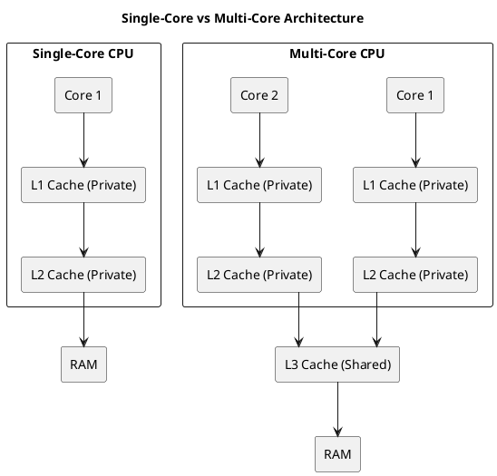

# Multi-Core Computer Architecture and Cache Optimization

## Single-Core vs Multi-Core Architecture

In modern computing, the evolution from single-core to multi-core processors has significantly impacted performance, especially in applications requiring parallel execution. Let's start by understanding the basic structures of these architectures and how cache is managed across them.

### Diagram of Single-Core vs Multi-Core Architecture

The following PlantUML diagram illustrates the difference between a single-core processor and a multi-core processor, highlighting the relationship between the CPU cores, their respective caches, and main memory.



### Cache Configuration on Your System

You can check the cache configuration of your system using the following command:

```bash
$ lscpu | grep -i cache
L1d cache:                          64 KiB (2 instances)
L1i cache:                          64 KiB (2 instances)
L2 cache:                           512 KiB (2 instances)
L3 cache:                           3 MiB (1 instance)
```

#### Interpretation

- **L1d & L1i caches**: 64 KiB each with **2 instances** → This suggests that L1 cache is **private per core**.
- **L2 cache**: 512 KiB with **2 instances** → Each core likely has its own private L2 cache.
- **L3 cache**: 3 MiB with **1 instance** → This indicates that L3 is **shared across all cores**.

### Conclusion

Your system has **private L2 caches per core** and a **shared L3 cache**, a common configuration found in modern processors, such as those from **Intel** and **AMD**. Each core has its own **L2 cache**, and all cores share the **L3 cache** to optimize data exchange and reduce bottlenecks.

## Cache Hierarchy and Sharing in Multi-Processor Machines

### Typical Cache Hierarchy

In multi-core processors, the cache hierarchy plays a crucial role in improving performance by minimizing the time taken to access frequently used data. Here's a breakdown of the typical cache levels:

1. **L1 Cache**: The smallest and fastest cache, private to each core.
2. **L2 Cache**: Larger than L1, usually private to each core but can also be shared in some systems.
3. **L3 Cache**: The largest cache, shared across all cores in the processor.
4. **Main Memory (RAM)**: The largest and slowest storage layer, accessed when data is not found in the caches.

### Cache Sharing and Potential Issues

- **Private Caches**: Cores have their own L1 and L2 caches, designed to provide fast access to frequently used data specific to each core.
- **Shared Cache**: The L3 cache is shared by all cores, allowing for efficient communication and data exchange between cores.

However, cache sharing introduces some challenges:

### Issues in Multi-Core Architectures

1. **Cache Coherence**: To ensure all cores have a consistent view of the data, cache coherence protocols (like MESI) are employed. These protocols track the state of each cache line to maintain consistency.
   
2. **False Sharing**: This occurs when different threads running on separate cores modify independent variables that reside on the same cache line. This leads to unnecessary cache invalidation, which can degrade performance.
   
3. **Cache Thrashing**: When multiple cores frequently access the same cache line, leading to frequent evictions and refills, performance suffers due to the overhead of constantly transferring data between caches and RAM.

## Understanding False Sharing

### What is False Sharing?

False sharing happens when **multiple threads on different CPU cores** modify independent variables that reside on the same cache line. This triggers unnecessary cache invalidation, causing performance to degrade as the cache lines are constantly refreshed and invalidated.

### Shared but "False"

In multi-core systems, each core has its private L1 and L2 caches, but all cores share an L3 cache. Memory is organized into **cache lines**, typically 64 bytes long. These cache lines are the smallest unit of data transferred between the CPU caches and RAM.

- **What is shared?** A cache line containing multiple variables used by different threads.
- **Why is it called "false"?** The variables are not logically shared between threads, but because they reside in the same cache line, the CPU's cache coherence mechanism treats the entire cache line as shared.

### When Does False Sharing Occur?

False sharing is common in **multi-threaded applications** where:
- Threads operate on different variables that are stored adjacently in memory.
- Cores have private caches (L1/L2) but share an L3 cache.
- Frequent updates happen on separate variables that share the same cache line.

The presence of cache coherence protocols, like MESI (Modified, Exclusive, Shared, Invalid), ensures that when a variable is modified, the corresponding cache line is invalidated across all cores. This leads to unnecessary performance degradation because the CPU cache system treats the entire cache line as modified, even when only one variable within that line is altered.

## Conclusion

Multi-core architectures, while offering a substantial increase in processing power, come with their own set of challenges in cache management. Cache coherence, false sharing, and cache thrashing can significantly impact performance if not handled correctly. Understanding how caches are shared and how false sharing occurs is critical for optimizing performance, especially in multi-threaded applications. By aligning the memory access patterns of threads with the architecture of the cache, performance can be maximized, reducing the unnecessary overhead caused by these issues.
