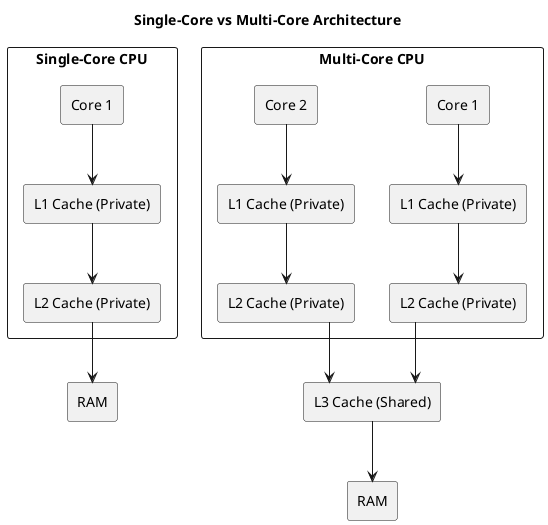

# Multi-Core Computer Architecture and Cache Optimization

## Cache Hierarchy and Sharing in Multi-Processor Machines

### Typical Cache Hierarchy

In multi-core processors, the cache hierarchy plays a crucial role in improving performance by minimizing the time taken to access frequently used data. Here's a breakdown of the typical cache levels:

1. **L1 Cache**: The smallest and fastest cache, private to each core.
2. **L2 Cache**: Larger than L1, usually private to each core but can also be shared in some systems.
3. **L3 Cache**: The largest cache, shared across all cores in the processor.
4. **Main Memory (RAM)**: The largest and slowest storage layer, accessed when data is not found in the caches.

### Single-Core vs Multi-Core Architecture

We moved from single-core to multi-core processors, which made computers faster, especially by running tasks in parallel. However, this also increased complexity for developers, requiring careful optimization for efficient code execution. To understand this better, let’s examine the basic structure of multi-core processors and how they handle memory and cache.

The following diagram illustrates the difference between a single-core processor and a multi-core processor, highlighting the relationship between CPU cores, their respective caches, and main memory.



#### Understanding the Diagram  

The diagram shows two types of processors:

1. **Single-Core Processor**  
   - Has **one** core handling all tasks.  
   - Includes **private L1 and L2 caches** to store frequently used data.  
   - Accesses **main memory (RAM)** when data is not available in the cache.  

2. **Multi-Core Processor**  
   - Has **multiple cores**, allowing parallel execution.  
   - Each core has its **own private L1 and L2 caches** (as commonly seen in Intel processors).  
   - An **L3 cache acts as a buffer for data exchange between cores and helps reduce main memory accesses**.  
   - Reduces the need to access **main memory**, improving performance.  

#### Why This Matters  

Multi-core processors improve speed and efficiency, but they also introduce **new challenges** like cache coherence, false sharing, and synchronization overhead. The rest of the article will explore these issues and their impact on performance.

### Checking Your CPU's Cache Configuration  

If you have an Intel processor like mine, you can check your system’s cache configuration using the following command:

```bash
$ lscpu | grep -i cache
L1d cache:                          64 KiB (2 instances)
L1i cache:                          64 KiB (2 instances)
L2 cache:                           512 KiB (2 instances)
L3 cache:                           3 MiB (1 instance)
```

*Note: This configuration is specific to my Intel processor and may differ for other models.*

#### Interpretation  

- **L1d & L1i caches**: 64 KiB each with **2 instances** → This indicates that L1 cache is **private per core**.  
- **L2 cache**: 512 KiB with **2 instances** → Each core likely has its own private L2 cache.  
- **L3 cache**: 3 MiB with **1 instance** → This shows that L3 cache is **shared across all cores**.  

This system has **private L1 and L2 caches per core** and a **shared L3 cache**, which is a common configuration in modern processors like those from **Intel**.

### Cache Sharing and Potential Issues  

- **Private Caches**: Cores have their own L1 and L2 caches, designed to provide fast access to frequently used data specific to each core.
- **Shared Cache**: The L3 cache is shared by all cores, allowing for efficient communication and data exchange between cores.

However, cache sharing introduces some challenges:

#### Issues in Multi-Core Architectures  

1. **Cache Coherence**: To ensure all cores have a consistent view of the data, cache coherence protocols (like MESI) are employed. These protocols track the state of each cache line to maintain consistency.
   
2. **False Sharing**: False sharing occurs when independent variables, stored in the same cache line, are modified by different threads running on separate cores. This results in unnecessary cache invalidation, reducing performance.
   
3. **Cache Thrashing**: When multiple cores frequently access and modify the same cache line, it leads to constant invalidation and reloading, significantly impacting performance.

