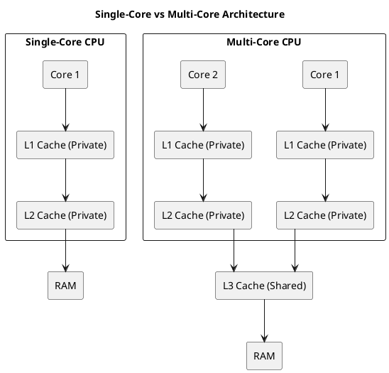
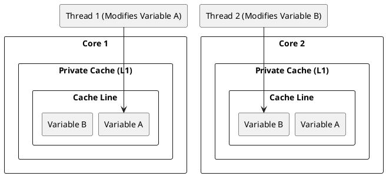
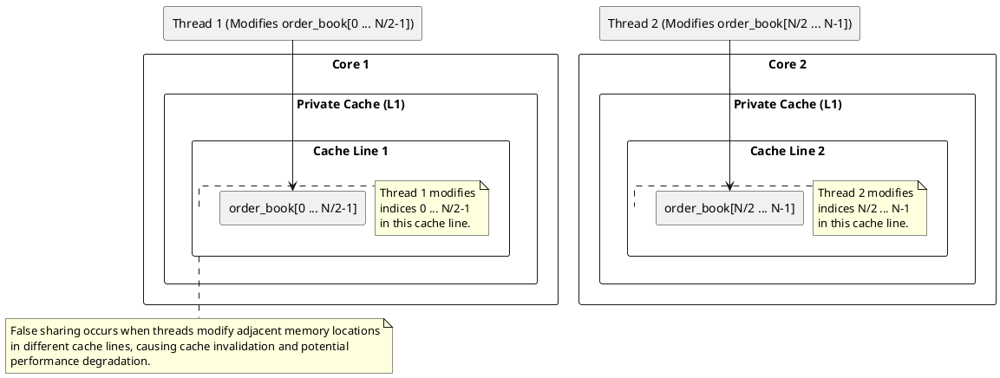
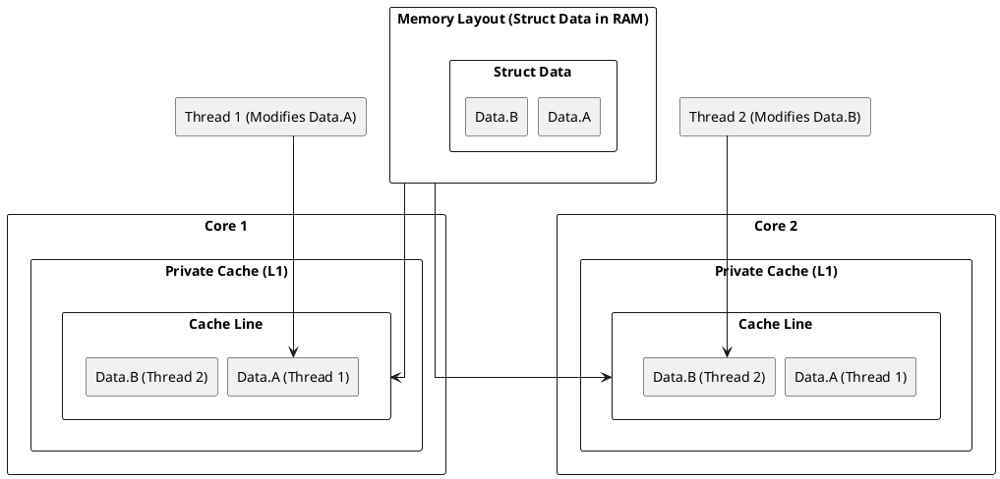

# Multi-core computer architecture and Cache:
## Diagram Single-Core vs Multi-Core Architecture


## Check Your system:

```bash
$ lscpu | grep -i cache
L1d cache:                          64 KiB (2 instances)
L1i cache:                          64 KiB (2 instances)
L2 cache:                           512 KiB (2 instances)
L3 cache:                           3 MiB (1 instance)
```

## **Interpretation**
- **L1d & L1i caches:** 64 KiB each, with **2 instances** → Likely **private per core**.
- **L2 cache:** 512 KiB with **2 instances** → This suggests that L2 is **private per core**, since there are 2 instances (matching the number of cores).
- **L3 cache:** 3 MiB with **1 instance** → This means L3 is **shared** across all cores.

### **Conclusion**
Your system has **private L2 caches per core** and a **shared L3 cache**.  
This is a common design in modern **Intel** and **AMD CPUs**, where each core has its own **L2**, and all cores share a larger **L3 cache** for efficient data exchange.

## Cache Hierarchy and Sharing in Multi-Processor Machines**

### **Typical Cache Hierarchy**
1. **L1 Cache**: Smallest and fastest, private to each core.
2. **L2 Cache**: Larger than L1, can be private or shared among cores.
3. **L3 Cache**: Largest, shared across all cores in a processor.
4. **Main Memory**: Accessed when data is not found in any cache.

### **Cache Sharing and Issues**
- **Private Caches**: Cores have their own L1/L2 caches.
- **Shared Caches**: L3 cache is shared among all cores.

# Issues introdices with the multicore architecture:
1. **Cache Coherence**: Handled using protocols like MESI.
2. **False Sharing**: Independent variables sharing the same cache line.
3. **Cache Thrashing**: Frequent evictions due to excessive sharing or contention.

# False Sharing

**What is False Sharing?**
False sharing happens when **multiple threads on different CPU cores** modify different variables **that reside on the same cache line**. This leads to **unnecessary cache invalidation** and slows down performance.
    
## Possible Scenarios of False Sharing
### Scenario 1: Multiple Threads Updating Separate Variables
    - Two or more threads update **different variables** that are **close in memory** (same cache line).
    - The cache line keeps getting invalidated even though threads aren't modifying each other's data.
#### Diagram


#### Diagram Description:
    - Core 1 and Core 2 each have their own Private Cache.
    - Both caches contain the same Cache Line, which holds Variable A and Variable B.
    - Thread 1 (running on Core 1) modifies Variable A.
    - Thread 2 (running on Core 2) modifies Variable B.
    Since Variable A and Variable B reside on the same cache line, modifying one variable causes the entire cache line to be invalidated in the other core's
    
#### Code: False Sharing with Separate Variables**
```cpp
#include <iostream>
#include <thread>

const int NUM_THREADS = 2;
const int NUM_ITER = 10000000;

struct SharedData {
    int a;  // Thread 1 modifies this
    int b;  // Thread 2 modifies this
} data;

void threadFunc1() {
    for (int i = 0; i < NUM_ITER; ++i) {
        data.a++;  // This will cause false sharing with data.b
    }
}

void threadFunc2() {
    for (int i = 0; i < NUM_ITER; ++i) {
        data.b++;  // This will cause false sharing with data.a
    }
}

int main() {
    std::thread t1(threadFunc1);
    std::thread t2(threadFunc2);
    t1.join();
    t2.join();
    std::cout << "Final values: " << data.a << ", " << data.b << std::endl;
}
```


### Scenario 2: Loop Processing with Separate Indices
- Threads process separate parts of an array, but **adjacent elements share the same cache line**.
- Example: Each thread processes a **different index**, but due to cache alignment, they keep invalidating each other's work.
#### Diagram


Here is an extensive documentation of the code, including an explanation of the possible false sharing issue and some background on order books and price level orders.

---

#### Code : Parallel Order Book Modification with Potential False Sharing

##### Introduction to the Order Book and Price Level Orders
In financial markets, an **order book** is a real-time list of all the buy and sell orders for a particular asset or security. The order book provides transparency and shows the depth of market activity. Each order in the book typically has two key components:
1. **Price**: The price at which the order is placed.
2. **Volume**: The amount of the asset to be bought or sold at the specified price.

Orders are usually placed at various price levels, where each price level can have a volume associated with it. An **order book level** represents one of these price points in the order book.

In the provided code, the task is to simulate the modification of the order book, specifically cancelling or modifying orders at different price levels. The `modify_orders` function simulates this by iterating over a subset of the order book and reducing the volume at the corresponding price levels.

##### Code Breakdown

```cpp
#include <iostream>
#include <vector>
#include <thread>
#include <atomic>
#include <chrono>

const int NUM_THREADS = 4;  // Number of threads to use for modifying orders

// Define the structure for representing an order book level
struct OrderBookLevel {  
    int price;    // Price of the order at this level
    int volume;   // Volume of the order at this price level
};

std::vector<OrderBookLevel> order_book;  // Global vector to hold the order book

// Function to modify orders in the order book
void modify_orders(int thread_id) {    
    int start_index = thread_id * (order_book.size() / NUM_THREADS);  // Starting index for the thread's portion
    int end_index = start_index + (order_book.size() / NUM_THREADS);  // Ending index for the thread's portion

    for (int i = start_index; i < end_index; ++i) {
        // Simulating order cancellation or modification
        if (order_book[i].volume > 100) {
            order_book[i].volume -= 100;  // Partial cancellation of orders at this price level
        }
    }
}

int main() { 
    // Assuming that the order_book vector will be populated in real-time

    std::vector<std::thread> threads;  // Vector to hold threads

    // Create and start the threads
    for (int i = 0; i < NUM_THREADS; ++i) {
        threads.emplace_back(modify_orders, i);  // Launch threads to modify orders in parallel
    }

    // Join all threads to ensure they complete their execution
    for (auto& t : threads) {
        t.join();
    }

    return 0;
}
```

##### Explanation of the Code:
1. **OrderBookLevel Structure**:
    - This structure represents a single order in the order book. Each `OrderBookLevel` object holds:
        - **price**: The price at which an order is placed.
        - **volume**: The amount of the asset to be bought or sold at that price.

2. **Global Order Book (`order_book`)**:
    - The `order_book` vector holds all the orders in the order book. Each entry in the vector represents an order at a particular price level.

3. **Multithreading**:
    - The code uses **multi-threading** to parallelize the modification of the order book. 
    - **NUM_THREADS** specifies the number of threads to use for processing the order book.
    - Each thread modifies a portion of the `order_book` vector, reducing the volume of orders by 100 if the volume is greater than 100.

4. **The `modify_orders` Function**:
    - This function is executed by each thread. It determines the range of indices in the order book that the current thread will modify. The `start_index` and `end_index` are calculated based on the thread ID and the total number of threads.
    - It iterates over the order book portion assigned to the thread and simulates the cancellation or modification of orders by decreasing the volume by 100 (if the volume is greater than 100).

5. **Thread Creation and Joining**:
    - Threads are created and started using `std::thread` to invoke the `modify_orders` function. Each thread is responsible for modifying a segment of the order book.
    - After all threads are started, the main thread waits for each one to finish using `join()`.

##### Possible False Sharing Issue in This Code

**False Sharing** occurs when multiple threads access and modify variables that reside on the same cache line, even though they are logically independent. The CPU uses cache lines to store data in memory, and when one thread modifies a variable, the entire cache line is invalidated and reloaded, even if other variables in the cache line are not being accessed. This can lead to unnecessary delays in multi-threaded applications, reducing overall performance.

#### In the Provided Code:
- The `order_book` vector is shared among all threads, and each thread modifies different entries (i.e., different `OrderBookLevel` objects). 
- However, if the `OrderBookLevel` objects are stored in memory in such a way that multiple objects (or their fields) share the same cache line, threads modifying different `OrderBookLevel` objects could end up invalidating the cache line unnecessarily.

For example:
- Suppose two adjacent `OrderBookLevel` objects are stored next to each other in memory. Each `OrderBookLevel` contains two `int` variables (price and volume). The total size of an `OrderBookLevel` is small, and the CPU cache line size is typically 64 bytes.
- If `OrderBookLevel[i].price` is modified by one thread and `OrderBookLevel[i+1].volume` is modified by another thread, both modifications could be on the same cache line.
- This would cause **false sharing** because the cache line containing `OrderBookLevel[i]` and `OrderBookLevel[i+1]` would be invalidated whenever one of the threads modifies its data, even though they are logically modifying independent variables.

##### Performance Impact of False Sharing:
When false sharing occurs, threads that modify different parts of the same cache line will cause cache coherence protocols (such as MESI) to constantly invalidate and reload cache lines, resulting in:
1. **Increased latency**: Threads will spend more time waiting for data to be fetched from memory instead of using the cache.
2. **Decreased throughput**: The performance of the multi-threaded application will degrade due to excessive cache invalidations and memory access delays.

##### How False Sharing Affects Order Book Modification:
- In the context of the order book, false sharing could impact the speed at which orders are modified in parallel. As the order book grows, the number of threads modifying independent price levels increases, and the potential for false sharing increases, which could severely degrade performance on a multicore system.
- Given that the order book typically contains a large number of price levels, this issue can become significant in high-frequency trading or real-time systems where fast order book updates are critical.

##### Conclusion:
This code demonstrates a typical scenario where false sharing might occur in a multithreaded application. Threads modifying adjacent `OrderBookLevel` objects in the `order_book` vector could inadvertently cause cache invalidations due to the variables being located on the same cache line. This could lead to performance degradation in systems that rely on high-speed, low-latency order book modifications.

---

This detailed documentation explains the false sharing issue that might arise in the code and provides a high-level understanding of how order books work and how false sharing can impact performance in a real-time trading system.
### Scenario 3: Thread-Local Variables Packed Together
- When multiple **thread-local variables** are allocated **next to each other in memory**, they might be part of the same cache line.
- Even though they are **logically separate**, updating them in parallel causes performance issues.

#### Diagram
@startuml
skinparam linetype ortho
skinparam nodesep 10
skinparam ranksep 20

title False Sharing in Thread-Local Variable

rectangle "Thread 1" as Thread1 {
    rectangle "thread_local int A" as TL_A_Thread1
}

rectangle "Thread 2" as Thread2 {
    rectangle "thread_local int A" as TL_A_Thread2
}

rectangle "Memory Layout (Compiler Allocates)" as Memory {
    rectangle "A (Thread 1)" as MemA_Thread1
    rectangle "A (Thread 2)" as MemA_Thread2
}

rectangle "Core 1" as Core1 {
    rectangle "Private Cache (L1)" as Cache1 {
        rectangle "Cache Line" as CacheLine1 {
            rectangle "A (Thread 1)" as CacheA_Thread1
            rectangle "A (Thread 2)" as CacheA_Thread2
        }
    }
}

rectangle "Core 2" as Core2 {
    rectangle "Private Cache (L1)" as Cache2 {
        rectangle "Cache Line" as CacheLine2 {
            rectangle "A (Thread 1)" as CacheA_Thread1_Core2
            rectangle "A (Thread 2)" as CacheA_Thread2_Core2
        }
    }
}

Thread1 --> TL_A_Thread1
Thread2 --> TL_A_Thread2

TL_A_Thread1 --> MemA_Thread1
TL_A_Thread2 --> MemA_Thread2

MemA_Thread1 --> CacheA_Thread1
MemA_Thread2 --> CacheA_Thread2

MemA_Thread1 --> CacheA_Thread1_Core2
MemA_Thread2 --> CacheA_Thread2_Core2

note bottom of CacheLine1
    False sharing occurs because 
    thread-local variables from different threads 
    are placed adjacently in memory.
end note

note bottom of CacheLine2
    When one thread modifies A, 
    the cache line is invalidated 
    for the other thread, causing performance degradation.
end note

@enduml
#### Code
```cpp
#include <thread>
#include <vector>

const int NUM_THREADS = 4;

// Thread-local variable (may be placed adjacently in memory for different threads)
thread_local int A = 0; 

void threadFunction() {
    for (int i = 0; i < 100000000; ++i) {
        A += 1;  // Each thread modifies its own thread-local copy of A
    }
}

int main() {
    std::vector<std::thread> threads;

    for (int i = 0; i < NUM_THREADS; ++i) {
        threads.emplace_back(threadFunction);
    }

    for (auto& t : threads) {
        t.join();
    }

    return 0;
}
```

#### Explanation
 You're asking a very sharp and insightful question! Let's break it down logically.  
---

##### **1. Why false sharing occurs in shared variables?**  
When multiple threads **write to adjacent elements** of a **shared** array (or struct fields), false sharing occurs because:  
- The adjacent memory locations **fall within the same cache line**.  
- Different cores modifying different parts of the cache line **invalidate each other’s cache**.  

This is the classic **false sharing case**, which is easy to visualize.

---

##### **2. What happens with `thread_local` variables?**  
With `thread_local`, each thread **has its own copy** of the variables.  
- Thread 1 has **`var1` and `var2` in Core 1’s cache**.  
- Thread 2 has **`var1` and `var2` in Core 2’s cache**.  
- The variables are **not shared** between threads.  
- Since each thread works on **its own memory**, they shouldn't interfere.  

This means **false sharing should NOT happen** in an ideal scenario.  

---

##### **3. When can false sharing still occur with `thread_local` variables?**  
Even though `thread_local` variables are per-thread, the **memory allocator** (or compiler) can allocate them **adjacent to each other** in memory.  

###### **Scenario where false sharing occurs:**
1. Thread 1's `var1` and Thread 2's `var1` are **stored next to each other in memory** (even though each thread accesses only its own).  
2. If these **adjacent variables fall into the same cache line**, then:  
   - Core 1 **loads the cache line** containing **Thread 1's `var1` and Thread 2's `var1`**.  
   - Core 2 **loads the same cache line** containing **Thread 1's `var1` and Thread 2's `var1`**.  
   - Even though **Thread 1 and Thread 2 never access each other’s variables**, they **share the same cache line**.  
3. When Thread 1 modifies its `var1`, the **entire cache line** is marked **dirty**.  
4. When Thread 2 modifies its `var1`, the **cache line in Core 1 gets invalidated**, causing expensive coherence updates.  

This is **false sharing**, even though there is no direct sharing of data.

---

##### **4. Why does this happen?**
The issue comes from how memory allocators work:  
- **Memory allocators often place thread-local variables next to each other** for efficiency.  
- The **cache system operates at the cache-line level, not at the variable level**.  
- So, even **logically separate** variables **might be grouped in the same cache line**.

---

##### **5. Can we prevent this?**  
Yes! We can force variables to be **separated into different cache lines** using **padding** or alignment:

```cpp
struct alignas(64) PaddedThreadLocal {
    thread_local static int var1;
    thread_local static int var2;
};
```

Or explicitly allocate **extra space**:

```cpp
alignas(64) thread_local int var1;
alignas(64) thread_local int var2;
```

This ensures that `var1` and `var2` are in **separate cache lines**, preventing false sharing.

---

##### **6. Summary:**
| Case | False Sharing? | Why? |
|------|--------------|------|
| **Shared adjacent array elements** | ✅ Yes | Different threads modify adjacent elements in the same cache line. |
| **Separate `thread_local` variables, properly spaced** | ❌ No | Each thread's variables are in separate cache lines. |
| **Adjacent `thread_local` variables without alignment** | ✅ Yes | Memory allocator may place different threads' variables in the same cache line. |

**Key takeaway:**  
False sharing **can** happen even with `thread_local` variables **if memory allocation places them next to each other in the same cache line**. The solution is to **force alignment to cache line boundaries**.

---


### Scenario 4: Struct with Multiple Members Accessed by Different Threads
- A struct has multiple members, and different threads **update different fields**.
- If those members fall into the **same cache line**, cache invalidation occurs unnecessarily.

#### Diagram 
Here’s a modified **PlantUML diagram** illustrating **false sharing in a struct**. The key change is that instead of two separate variables (`A` and `B`), we now have a **struct `Data` containing two members (`A` and `B`)**, which are accessed by different threads.  

##### **PlantUML Diagram for False Sharing in a Struct**


##### **Key Points in the Diagram:**
1. **Struct Packing:**  
   - `Data.A` and `Data.B` are inside the same **struct `Data`**.
   - Since structs **allocate members contiguously**, both `A` and `B` will likely be in the **same cache line**.

2. **Cache Behavior in Multi-Core System:**  
   - **Core 1 loads `Data.A` and `Data.B` into its cache.**
   - **Core 2 also loads `Data.A` and `Data.B` into its cache.**
   - Each **thread modifies a separate struct member**, but they belong to the **same cache line**.

3. **False Sharing Issue:**  
   - **Thread 1 modifies `Data.A` → Invalidates Core 2's cache.**  
   - **Thread 2 modifies `Data.B` → Invalidates Core 1's cache.**  
   - Even though the **threads are not sharing variables**, their **cache lines overlap**, causing unnecessary cache coherence traffic.

---

##### **Would You Like to Add Padding to Prevent False Sharing?**  
We can modify the struct with **padding (`alignas(64)`)** to ensure `A` and `B` are **stored in separate cache lines**. Let me know if you'd like an improved version with padding! 😊

#### Code 
Certainly! Here’s the **C++ code sample** for a **false sharing** scenario involving adjacent variables in a struct, where two threads modify different fields of the same struct:

##### **C++ Code Example (False Sharing with Adjacent Variables in Struct)**

```cpp
#include <iostream>
#include <thread>

const int NUM_THREADS = 2;
const int NUM_ITER = 10000000;

struct SharedData {
    int a;  // Thread 1 modifies this
    int b;  // Thread 2 modifies this
} data;

void threadFunc1() {
    for (int i = 0; i < NUM_ITER; ++i) {
        data.a++;  // This will cause false sharing with data.b
    }
}

void threadFunc2() {
    for (int i = 0; i < NUM_ITER; ++i) {
        data.b++;  // This will cause false sharing with data.a
    }
}

int main() {
    // Launch two threads
    std::thread t1(threadFunc1);
    std::thread t2(threadFunc2);
    
    // Wait for threads to finish execution
    t1.join();
    t2.join();
    
    // Output final values (due to false sharing, results may be inconsistent)
    std::cout << "Final values: " << data.a << ", " << data.b << std::endl;
}
```

##### **Key Explanation:**
1. **Data Structure (`SharedData`):**  
   - This struct contains **two adjacent variables (`a` and `b`)**. These variables are likely to fall into the **same cache line** because they are declared contiguously in memory.

2. **Thread Functions (`threadFunc1` and `threadFunc2`):**  
   - **Thread 1** increments `data.a`.
   - **Thread 2** increments `data.b`.
   - Because both threads modify **adjacent variables** that are likely stored in the **same cache line**, this results in **false sharing**.
   - As a result, when **Thread 1** updates `data.a`, it invalidates the cache line for **Thread 2**'s `data.b` (and vice versa).

3. **False Sharing Consequence:**  
   - The cache coherence mechanism causes unnecessary cache invalidations, reducing the performance because of the extra overhead from constantly invalidating the cache line and fetching it again. This is especially noticeable with a high number of iterations (`NUM_ITER`).

4. **Expected Output:**  
   - The final values of `data.a` and `data.b` may not be as expected due to the cache invalidations and synchronization issues caused by false sharing.
  
---

##### **How to Mitigate False Sharing in this Case?**

To avoid false sharing, you could add padding or use compiler-specific alignment to ensure that `data.a` and `data.b` are placed in **separate cache lines**. Here's an improved version of the struct with padding to prevent false sharing:

##### **Mitigating False Sharing with Padding:**
```cpp
struct alignas(64) SharedData {
    int a;  // Thread 1 modifies this
    char pad[64];  // Padding to ensure 'a' and 'b' are on separate cache lines
    int b;  // Thread 2 modifies this
};
```

This `alignas(64)` ensures that each variable will be aligned to a **64-byte boundary**, which helps prevent them from being placed in the same cache line.

---
