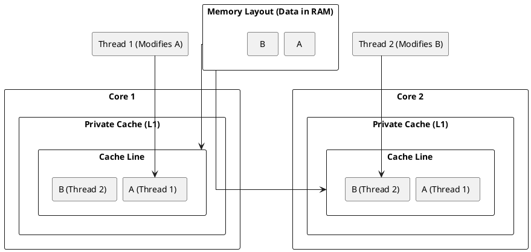
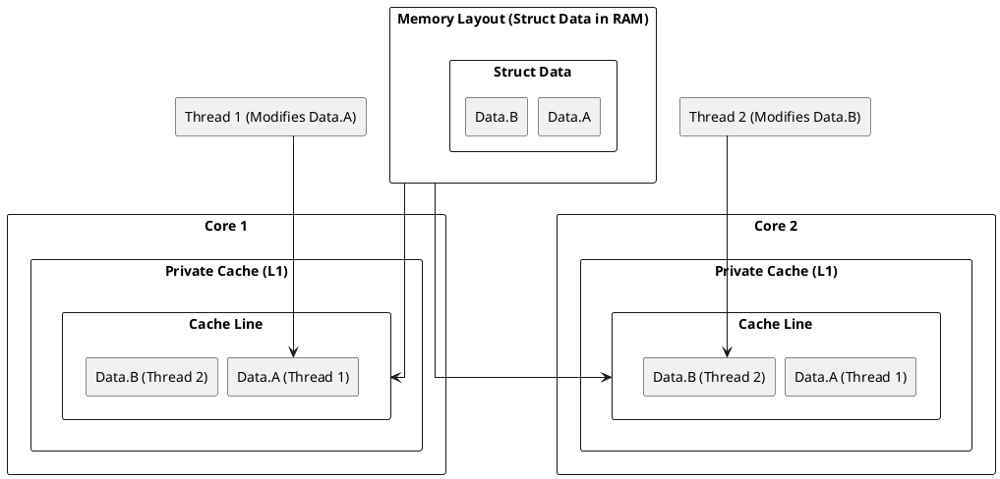

### **Scenario 1: False Sharing When Multiple Threads Modify Adjacent Variables**

#### **1.A: False Sharing with Independent Variables**

False sharing occurs when data that are placed adjacently in memory are modified by different threads. Modern compilers and memory allocators often place frequently accessed global or heap-allocated variables close to each other, causing them to share a cache line. This leads to performance degradation due to unnecessary cache invalidations.

#### **Cache Line Contention: Visual Representation**

##### **Diagram for False Sharing in Adjacent Data**



#### **Code Example: False Sharing Without Struct**

```cpp
#include <iostream>
#include <thread>
const int NUM_ITER = 10000000;

int a = 0; // Modified by Thread 1
int b = 0; // Modified by Thread 2

void threadFunc1() {
    for (int i = 0; i < NUM_ITER; ++i) {
        a++;
    }
}

void threadFunc2() {
    for (int i = 0; i < NUM_ITER; ++i) {
        b++;
    }
}

int main() {
    std::thread t1(threadFunc1);
    std::thread t2(threadFunc2);
    t1.join();
    t2.join();
    std::cout << "Final values: " << a << ", " << b << std::endl;
}
```

Even though `a` and `b` are independent, they may still be placed within the same cache line without explicit alignment, leading to unnecessary cache invalidations.

#### **Optimizing for Performance: Mitigating False Sharing in Independent Variables**

##### **1. Use Alignment to Separate Variables**
###### **a. Use Heap Allocation with Alignment**

```cpp
alignas(64) int a = 0; 
alignas(64) int b = 0; 
```

###### **b. Use Heap Allocation with Alignment**
```cpp
int* a = static_cast<int*>(std::aligned_alloc(64, 64));
int* b = static_cast<int*>(std::aligned_alloc(64, 64));
```

> **Prevents automatic adjacent placement in memory.**

##### **2. Use Padding to Separate Variables**

```cpp
struct PaddedInt {
    int value;
    char padding[60]; // Assuming a 64-byte cache line
};

PaddedInt a;
PaddedInt b;
```

> **Manually ensures `a` and `b` do not reside in the same cache line.**

---

#### **1.B: False Sharing with Struct Variables**

In multi-core systems, false sharing occurs when two threads modify separate variables that reside within the same cache line. Even though the threads do not explicitly share data, cache coherence protocols cause unnecessary data invalidations, leading to performance degradation.

#### **Cache Line Contention: Visual Representation**

##### **Diagram for False Sharing in a Struct**



In this diagram, `Variable A` and `Variable B` are stored in the same cache line, causing both cores to continuously invalidate each other's cache when either variable is updated.

#### **C++ Code Demonstration: False Sharing in Struct**

```cpp
#include <iostream>
#include <thread>
const int NUM_THREADS = 2;
const int NUM_ITER = 10000000;

struct SharedData {
    int a;  // Modified by Thread 1
    int b;  // Modified by Thread 2
} data;

void threadFunc1() {
    for (int i = 0; i < NUM_ITER; ++i) {
        data.a++;  // This will cause false sharing with data.b
    }
}

void threadFunc2() {
    for (int i = 0; i < NUM_ITER; ++i) {
        data.b++;  // This will cause false sharing with data.a
    }
}

int main() {
    std::thread t1(threadFunc1);
    std::thread t2(threadFunc2);
    t1.join();
    t2.join();
    // Output final values (due to false sharing, results may be inconsistent)
    std::cout << "Final values: " << data.a << ", " << data.b << std::endl;
}
```

Even though `a` and `b` are updated by separate threads, their proximity in memory leads to false sharing, causing excessive cache coherence traffic and slowing down execution.

### **Optimizing for Performance: Mitigating False Sharing in Struct Variables**

##### **1. Cache Line Padding with `alignas(64)`**

```cpp
struct alignas(64) SharedData {
    int a;
    int b;
};
```

> **Forces `a` and `b` to be allocated in different cache lines, reducing contention.**

##### **2. Splitting Variables into Separate Structures**

```cpp
struct DataA { int a; };
struct DataB { int b; };
```

> **Ensures that `a` and `b` are independently allocated and do not share cache lines.**

##### **3. Using Thread-Local Storage (`thread_local`)**

```cpp
thread_local int a;
thread_local int b;
```

> **Each thread gets a separate copy of the variable, eliminating cache contention.**

##### **4. Explicit Memory Allocation with Large Gaps**

```cpp
int* a = static_cast<int*>(std::aligned_alloc(64, 64));
int* b = static_cast<int*>(std::aligned_alloc(64, 64));
```

> **Guarantees memory placement on separate cache lines.**

##### **5. Restructuring Workloads to Avoid Shared Data**

> **The best way to avoid false sharing is to avoid sharing data altogether.**

---

