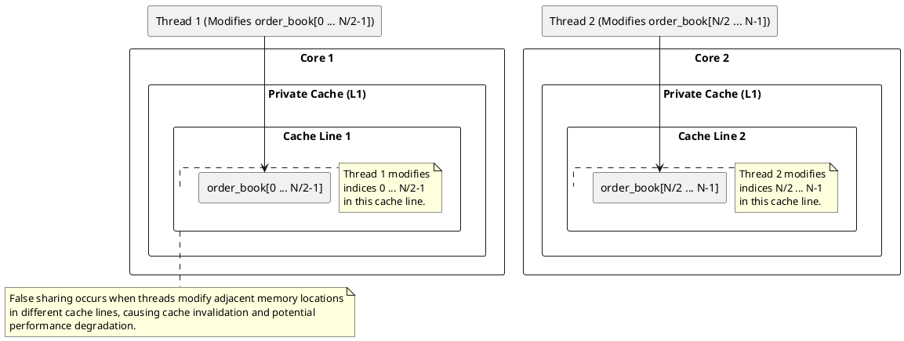

Here is the revised content with the specified sections removed and possible solutions for avoiding false sharing added in order of efficiency:

### Scenario 2: Loop Processing with Separate Indices

- Threads process separate parts of an array, but **adjacent elements share the same cache line**.
- Example: Each thread processes a **different index**, but due to cache alignment, they keep invalidating each other's work.

#### Diagram


---

### Code: Parallel Order Book Modification with Potential False Sharing

#### Introduction to the Order Book and Price Level Orders
In financial markets, an **order book** is a real-time list of buy and sell orders for a particular asset. Each order has:
1. **Price**: The price at which the order is placed.
2. **Volume**: The amount of the asset to be bought or sold at the specified price.

Orders are placed at various price levels, and each level represents a price point in the order book.

#### Code Breakdown

```cpp
#include <iostream>
#include <vector>
#include <thread>
#include <atomic>
#include <chrono>

const int NUM_THREADS = 4;  // Number of threads to use for modifying orders

// Structure for representing an order book level
struct OrderBookLevel {  
    int price;    // Price of the order at this level
    int volume;   // Volume of the order at this price level
};

std::vector<OrderBookLevel> order_book;  // Global vector to hold the order book

// Function to modify orders in the order book
void modify_orders(int thread_id) {    
    int start_index = thread_id * (order_book.size() / NUM_THREADS);  // Starting index for the thread's portion
    int end_index = start_index + (order_book.size() / NUM_THREADS);  // Ending index for the thread's portion

    for (int i = start_index; i < end_index; ++i) {
        // Simulating order cancellation or modification
        if (order_book[i].volume > 100) {
            order_book[i].volume -= 100;  // Partial cancellation of orders at this price level
        }
    }
}

int main() { 
    std::vector<std::thread> threads;  // Vector to hold threads

    // Create and start the threads
    for (int i = 0; i < NUM_THREADS; ++i) {
        threads.emplace_back(modify_orders, i);  // Launch threads to modify orders in parallel
    }

    // Join all threads to ensure they complete their execution
    for (auto& t : threads) {
        t.join();
    }

    return 0;
}
```

#### Explanation of the Code:
1. **OrderBookLevel Structure**:
    - Represents a single order in the order book, containing `price` and `volume`.

2. **Global Order Book (`order_book`)**:
    - A vector holding all orders in the order book, with each entry representing an order at a specific price level.

3. **Multithreading and Multicore Processing**:
    - The code leverages **multi-threading** to parallelize the modification of the order book, taking advantage of multicore processors to enhance performance.
    - Each thread modifies a portion of the `order_book` vector independently, reducing the volume of orders by 100 if the volume is greater than 100.

4. **The `modify_orders` Function**:
    - Each thread processes a segment of the order book, determined by `start_index` and `end_index`.
    - It simulates order cancellation or modification by decreasing the volume by 100 (if the volume is greater than 100).

5. **Thread Creation and Joining**:
    - Threads are created using `std::thread` and joined after execution to ensure completion.

#### Possible False Sharing Issue in This Code

**False Sharing** occurs when multiple threads modify variables on the same cache line, even if the variables are logically independent. This causes cache invalidations and reloads, leading to performance degradation.

#### In the Provided Code:
- The `order_book` vector is shared among all threads, and each thread modifies different `OrderBookLevel` objects.
- If adjacent `OrderBookLevel` objects share the same cache line, threads modifying different objects could invalidate the cache line unnecessarily.

For example:
- If `OrderBookLevel[i].price` is modified by one thread and `OrderBookLevel[i+1].volume` is modified by another, both modifications could be on the same cache line.
- This causes **false sharing**, as the cache line is invalidated whenever one thread modifies its data, even though the variables are independent.


## Possible solutions to False Sharing (Ordered by Efficiency)

### 1. Structure of Arrays (SoA) - Most Efficient

Instead of storing **price** and **volume** together in a single structure (Array of Structures), we use **separate arrays** for each field.

#### Example:

```cpp
#include <iostream>
#include <vector>
#include <thread>

const int NUM_THREADS = 4;
const int ORDER_BOOK_SIZE = 1000;

// Separate arrays for prices and volumes
std::vector<int> prices(ORDER_BOOK_SIZE);
std::vector<int> volumes(ORDER_BOOK_SIZE);

void modify_volumes(int thread_id) {
    int start_index = thread_id * (volumes.size() / NUM_THREADS);
    int end_index = start_index + (volumes.size() / NUM_THREADS);

    for (int i = start_index; i < end_index; ++i) {
        if (volumes[i] > 100) {
            volumes[i] -= 100; // Modify only volumes, preventing false sharing
        }
    }
}

int main() {
    std::vector<std::thread> volume_threads;
    
    for (int i = 0; i < NUM_THREADS; ++i) {
        volume_threads.emplace_back(modify_volumes, i);
    }

    for (auto& t : volume_threads) t.join();
    return 0;
}
```

### When SoA May Not Be Applicable:
If **price and volume are tightly coupled** (e.g., volume modifications depend on price), then separating them into different arrays **may not work**. In such cases, other solutions are needed.

### 2. Padding Structures

Adding explicit padding prevents multiple elements from sharing the same cache line.

```cpp
struct OrderBookLevel {  
    int price;    
    int volume;   
    char padding[64];  // Padding to avoid false sharing
};
```

### 3. Aligning Data

Use `alignas(64)` to enforce cache-line alignment.

```cpp
struct alignas(64) OrderBookLevel {  
    int price;    
    int volume;   
};
```

### 4. Partitioning Data Across Cores


Follwing is the optimized partitioning method that eliminates false sharing using a combination of **padding, cache line alignment, and structured data partitioning.

#### Optimized Partitioning: Zero False Sharing**
```cpp
#include <vector>
#include <thread>
#include <iostream>
#include <atomic>

const int NUM_THREADS = 4;
const int ORDER_BOOK_SIZE = 1000;
const int CACHE_LINE_SIZE = 64;  // Typical cache line size in bytes

// Order struct aligned to prevent false sharing
struct alignas(CACHE_LINE_SIZE) Order {
    int price;
    int volume;
    char padding[CACHE_LINE_SIZE - sizeof(int) * 2];  // Padding to ensure isolation in cache
};

// Order book with properly aligned orders
std::vector<Order> order_book(ORDER_BOOK_SIZE);

void process_partition(int thread_id, int start, int end) {
    for (int i = start; i < end; ++i) {
        order_book[i].volume += 10;  // Simulating an order update
    }
    std::cout << "Thread " << thread_id << " processed data from " << start << " to " << end << "\n";
}

int main() {
    std::vector<std::thread> threads;
    int chunk_size = (ORDER_BOOK_SIZE + NUM_THREADS - 1) / NUM_THREADS;  // Round-up division

    for (int i = 0; i < NUM_THREADS; ++i) {
        int start = i * chunk_size;
        int end = std::min(start + chunk_size, ORDER_BOOK_SIZE);
        threads.emplace_back(process_partition, i, start, end);
    }

    for (auto& t : threads) t.join();
    return 0;
}
```

---

#### ** How This Fixes False Sharing**

1. **`alignas(CACHE_LINE_SIZE)`**: Ensures the struct's starting address aligns with a cache line boundary, preventing multiple threads from accessing the same cache line.  
2. **Explicit Padding `char padding[CACHE_LINE_SIZE - sizeof(int) * 2]`** : Guarantees the struct's size matches the cache line size, avoiding overlap into adjacent cache lines.  
3. **Combination**: For single instances, use both `alignas` and padding to ensure proper alignment and size. For arrays, `alignas` alone suffices, as it ensures proper alignment and size without manual padding.  
4. **Purpose Solved**: Optimizes memory access patterns, reduces cache invalidation, and improves performance in multi-threaded applications.

1. **Struct Padding (`Order` struct)**
   - The `Order` struct is **aligned to 64 bytes** (`alignas(64)`) to ensure each instance occupies a full cache line.
   - The `char padding[56]` ensures **no two `Order` elements share the same cache line**.

2. **Aligned Memory Access**
   - `std::vector<Order>` ensures **each order is stored in its own cache line**.
   - This prevents cache-line contention between adjacent elements.

3. **Partitioning Without Overlap**
   - Threads get exclusive, non-overlapping chunks.
   - `chunk_size = (ORDER_BOOK_SIZE + NUM_THREADS - 1) / NUM_THREADS;` ensures near-equal distribution.

4. **Prevents False Sharing at Chunk Boundaries**
   - Since each `Order` is **64-byte aligned**, modifying `order_book[i]` and `order_book[i+1]` **never affects the same cache line**.

---

#### ** Why This is Fully False Sharing Free**
✔ **Each thread gets a separate, non-overlapping memory region.**  
✔ **Each `Order` is naturally aligned to avoid adjacent modifications in the same cache line.**  
✔ **Threads access contiguous, cache-friendly memory, boosting performance.**  


### 5. Using Local Buffers and Merging Results
Each thread processes data in its **local buffer**, then merges it back after completion.

---

## Conclusion
**False sharing** can significantly degrade performance in **multi-threaded order book processing**. The **most efficient solution** is to use **Structure of Arrays (SoA)**, but when price-volume modifications are interdependent, alternative methods like **padding, alignment, partitioning, and local buffers** should be considered.

By choosing the right approach, **low-latency financial applications** can achieve optimal performance while minimizing cache contention.


