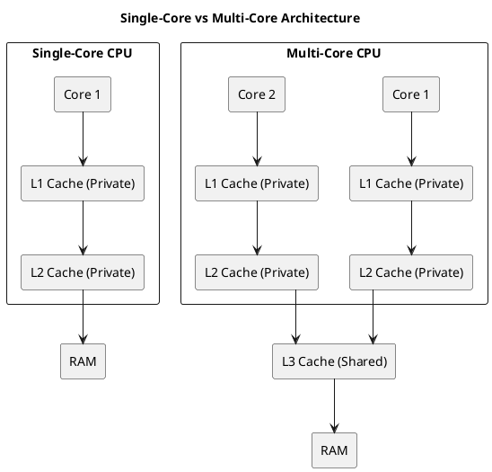
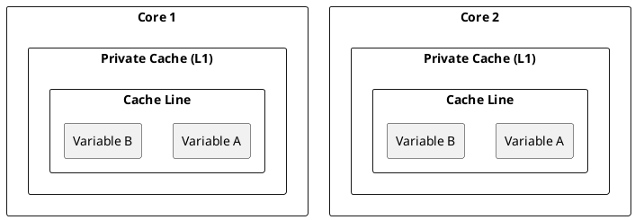
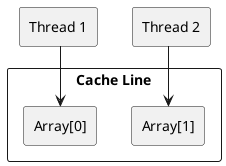
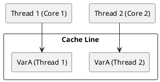
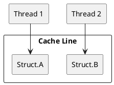

# Understanding False Sharing in Multi-Core Architectures

## Multi-Core Computer Architecture and Cache

### Single-Core vs Multi-Core Architecture

#### **Diagram: Single-Core vs Multi-Core Architecture**


### Checking Your System's Cache
Run the following command to inspect your system's cache hierarchy:
```bash
$ lscpu | grep -i cache
L1d cache:                          64 KiB (2 instances)
L1i cache:                          64 KiB (2 instances)
L2 cache:                           512 KiB (2 instances)
L3 cache:                           3 MiB (1 instance)
```

### **Interpretation**
- **L1d & L1i caches:** 64 KiB each, with **2 instances** → Likely **private per core**.
- **L2 cache:** 512 KiB with **2 instances** → Suggests **private per core**.
- **L3 cache:** 3 MiB with **1 instance** → Indicates **shared L3 cache**.

## Cache Hierarchy and False Sharing

### **Typical Cache Hierarchy**
1. **L1 Cache**: Smallest and fastest, private to each core.
2. **L2 Cache**: Larger than L1, can be private or shared among cores.
3. **L3 Cache**: Largest, shared across all cores in a processor.
4. **Main Memory**: Accessed when data is not found in any cache.

### **Key Issues in Multi-Core Architectures**
1. **Cache Coherence**: Managed using protocols like MESI.
2. **False Sharing**: Independent variables sharing the same cache line.
3. **Cache Thrashing**: Frequent evictions due to excessive sharing or contention.

# Understanding False Sharing

### **What is False Sharing?**

False sharing occurs when multiple threads on different CPU cores modify independent variables that reside on the same cache line. This leads to unnecessary cache invalidation, degrading performance.

### **What is Shared and Why is it False?**
In multi-core architectures, each core has its own private L1 and L2 caches, but they share an L3 cache. Memory is divided into **cache lines**, typically 64 bytes long. A cache line is the smallest unit of memory transferred between RAM and the CPU caches.

- **What is shared?**
  - A cache line containing multiple independent variables used by different threads.
- **Why is it called 'False Sharing'?**
  - The variables are **not logically shared** between threads, but they **reside in the same cache line**. Thus, even though threads are working on separate variables, the CPU cache system treats the entire cache line as shared.

### **In Which Environment Does False Sharing Occur?**
False sharing is common in **multi-threaded applications** where:
- Threads operate on different variables stored adjacently in memory.
- Cores have private caches but share a unified L3 cache.
- Frequent updates occur on separate variables that happen to be in the same cache line.

Since modern CPUs use **cache coherence protocols** (e.g., MESI), modifying a variable forces an invalidation of the entire cache line in other cores, even when modifications are unrelated. This results in performance degradation.
False sharing occurs when **multiple threads on different CPU cores** modify different variables **that reside on the same cache line**. This leads to **unnecessary cache invalidation**, degrading performance.

### **Scenario 1: Multiple Threads Updating Separate Variables**

#### **Impact of False Sharing in Separate Variables**

#### **Diagram**


#### **Code Example: Demonstrating False Sharing**
```cpp
#include <iostream>
#include <thread>
const int NUM_THREADS = 2;
const int NUM_ITER = 10000000;

struct SharedData {
    int a;  // Thread 1 modifies this
    int b;  // Thread 2 modifies this
} data;

void threadFunc1() {
    for (int i = 0; i < NUM_ITER; ++i) {
        data.a++;
    }
}

void threadFunc2() {
    for (int i = 0; i < NUM_ITER; ++i) {
        data.b++;
    }
}

int main() {
    std::thread t1(threadFunc1);
    std::thread t2(threadFunc2);
    t1.join();
    t2.join();
    std::cout << "Final values: " << data.a << ", " << data.b << std::endl;
}
```

#### **Solutions (Ordered by Efficiency)**
1. **Use `alignas(64)` Padding:** Ensures variables are placed in separate cache lines.
   ```cpp
   struct alignas(64) SharedData {
       int a;
       int b;
   };
   ```
2. **Separate Variables into Different Structures:** Instead of storing both variables in the same structure, place them in separate structures.
   ```cpp
   struct DataA { int a; };
   struct DataB { int b; };
   ```
3. **Use Thread-Local Storage (`thread_local`)**: Ensures each thread has its own copy of the variable.
   ```cpp
   thread_local int a;
   thread_local int b;
   ```
4. **Explicit Memory Allocation with Large Gaps:** Using `std::aligned_alloc` to ensure variables are allocated separately.
   ```cpp
   int* a = static_cast<int*>(std::aligned_alloc(64, sizeof(int)));
   int* b = static_cast<int*>(std::aligned_alloc(64, sizeof(int)));
   ```
5. **Rearrange Workload to Avoid Shared Data:** If possible, modify the algorithm so that each thread works on entirely different data regions.


#### **Solutions (Ordered by Efficiency):**
1. **Use `alignas(64)` Padding:** Ensures variables are placed in separate cache lines.
   ```cpp
   struct alignas(64) SharedData {
       int a;
       int b;
   };
   ```
2. **Separate Variables into Different Structures:** Instead of storing both variables in the same structure, place them in separate structures.
   ```cpp
   struct DataA { int a; };
   struct DataB { int b; };
   ```
3. **Use Thread-Local Storage (`thread_local`)**: Ensures each thread has its own copy of the variable.
   ```cpp
   thread_local int a;
   thread_local int b;
   ```
4. **Explicit Memory Allocation with Large Gaps:** Using `std::aligned_alloc` to ensure variables are allocated separately.
   ```cpp
   int* a = static_cast<int*>(std::aligned_alloc(64, sizeof(int)));
   int* b = static_cast<int*>(std::aligned_alloc(64, sizeof(int)));
   ```
5. **Rearrange Workload to Avoid Shared Data:** If possible, modify the algorithm so that each thread works on entirely different data regions.


#### **Diagram**


#### **Code Example**: False Sharing with Separate Variables
```cpp
#include <iostream>
#include <thread>
const int NUM_THREADS = 2;
const int NUM_ITER = 10000000;

struct SharedData {
    int a;  // Thread 1 modifies this
    int b;  // Thread 2 modifies this
} data;

void threadFunc1() {
    for (int i = 0; i < NUM_ITER; ++i) {
        data.a++;
    }
}

void threadFunc2() {
    for (int i = 0; i < NUM_ITER; ++i) {
        data.b++;
    }
}

int main() {
    std::thread t1(threadFunc1);
    std::thread t2(threadFunc2);
    t1.join();
    t2.join();
    std::cout << "Final values: " << data.a << ", " << data.b << std::endl;
}
```

### **Scenario 2: Loop Processing with Separate Indices**
#### **Diagram**


### **Scenario 3: Thread-Local Variables Packed Together**
#### **Diagram**


### **Scenario 4: Struct with Multiple Members Accessed by Different Threads**
#### **Diagram**


## **Conclusion**
False sharing significantly degrades multi-threaded performance by causing unnecessary cache invalidations. Proper data alignment, padding, and struct organization can effectively mitigate the issue, leading to more efficient multi-core computing.

