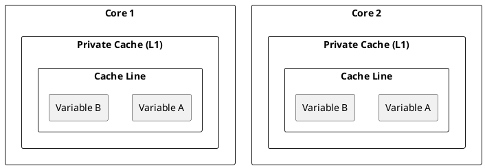
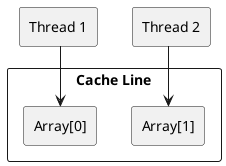
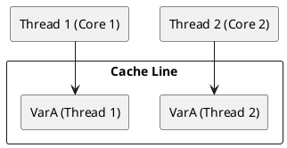
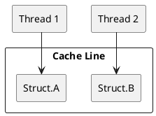

#### **Solutions (Ordered by Efficiency):**
1. **Use `alignas(64)` Padding:** Ensures variables are placed in separate cache lines.
   ```cpp
   struct alignas(64) SharedData {
       int a;
       int b;
   };
   ```
2. **Separate Variables into Different Structures:** Instead of storing both variables in the same structure, place them in separate structures.
   ```cpp
   struct DataA { int a; };
   struct DataB { int b; };
   ```
3. **Use Thread-Local Storage (`thread_local`)**: Ensures each thread has its own copy of the variable.
   ```cpp
   thread_local int a;
   thread_local int b;
   ```
4. **Explicit Memory Allocation with Large Gaps:** Using `std::aligned_alloc` to ensure variables are allocated separately.
   ```cpp
   int* a = static_cast<int*>(std::aligned_alloc(64, sizeof(int)));
   int* b = static_cast<int*>(std::aligned_alloc(64, sizeof(int)));
   ```
5. **Rearrange Workload to Avoid Shared Data:** If possible, modify the algorithm so that each thread works on entirely different data regions.


#### **Diagram**


#### **Code Example**: False Sharing with Separate Variables
```cpp
#include <iostream>
#include <thread>
const int NUM_THREADS = 2;
const int NUM_ITER = 10000000;

struct SharedData {
    int a;  // Thread 1 modifies this
    int b;  // Thread 2 modifies this
} data;

void threadFunc1() {
    for (int i = 0; i < NUM_ITER; ++i) {
        data.a++;
    }
}

void threadFunc2() {
    for (int i = 0; i < NUM_ITER; ++i) {
        data.b++;
    }
}

int main() {
    std::thread t1(threadFunc1);
    std::thread t2(threadFunc2);
    t1.join();
    t2.join();
    std::cout << "Final values: " << data.a << ", " << data.b << std::endl;
}
```

### **Scenario 2: Loop Processing with Separate Indices**
#### **Diagram**


### **Scenario 3: Thread-Local Variables Packed Together**
#### **Diagram**


### **Scenario 4: Struct with Multiple Members Accessed by Different Threads**
#### **Diagram**


## **Conclusion**
False sharing significantly degrades multi-threaded performance by causing unnecessary cache invalidations. Proper data alignment, padding, and struct organization can effectively mitigate the issue, leading to more efficient multi-core computing.

