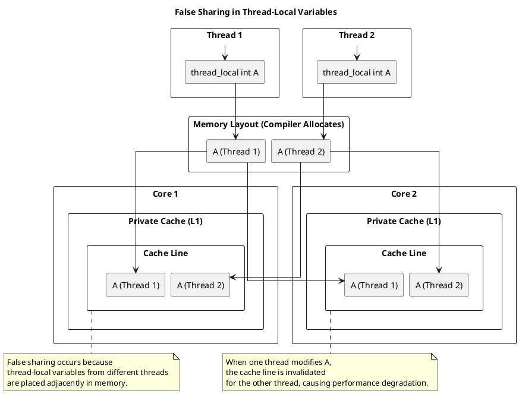

### Scenario 3: Thread-Local Variables Packed Together
- When multiple **thread-local variables** are allocated **adjacent in memory**, they may share the same cache line.
- Despite being **logically separate**, parallel updates can cause performance issues due to false sharing.

#### Diagram


#### Code
```cpp
#include <thread>
#include <vector>

const int NUM_THREADS = 4;

// Thread-local variable (may be placed adjacently in memory for different threads)
thread_local int A = 0; 

void threadFunction() {
    for (int i = 0; i < 100000000; ++i) {
        A += 1;  // Each thread modifies its own thread-local copy of A
    }
}

int main() {
    std::vector<std::thread> threads;

    for (int i = 0; i < NUM_THREADS; ++i) {
        threads.emplace_back(threadFunction);
    }

    for (auto& t : threads) {
        t.join();
    }

    return 0;
}
```

#### Explanation
---

##### **1. Why False Sharing Occurs in Shared Variables**  
False sharing happens when multiple threads **write to adjacent elements** of a **shared** array or struct fields:  
- Adjacent memory locations **fall within the same cache line**.  
- Different cores modifying different parts of the cache line **invalidate each other’s cache**.  

---

##### **2. Behavior of `thread_local` Variables**  
With `thread_local`, each thread **has its own copy** of the variables:  
- Thread 1 has **`var1` and `var2` in Core 1’s cache**.  
- Thread 2 has **`var1` and `var2` in Core 2’s cache**.  
- Variables are **not shared** between threads, so they shouldn't interfere.  

---

##### **3. When False Sharing Occurs with `thread_local` Variables**  
Even though `thread_local` variables are per-thread, the **memory allocator** (or compiler) can allocate them **adjacent in memory**:  

1. Thread 1's `var1` and Thread 2's `var1` are **stored next to each other in memory**.  
2. If these **adjacent variables fall into the same cache line**:  
   - Core 1 **loads the cache line** containing **Thread 1's `var1` and Thread 2's `var1`**.  
   - Core 2 **loads the same cache line** containing **Thread 1's `var1` and Thread 2's `var1`**.  
   - Even though **Thread 1 and Thread 2 never access each other’s variables**, they **share the same cache line**.  
3. When Thread 1 modifies its `var1`, the **entire cache line** is marked **dirty**.  
4. When Thread 2 modifies its `var1`, the **cache line in Core 1 gets invalidated**, causing expensive coherence updates.  

This is **false sharing**, despite no direct data sharing.

---

##### **4. Root Cause**  
The issue arises from memory allocator behavior:  
- **Memory allocators often place thread-local variables next to each other** for efficiency.  
- The **cache system operates at the cache-line level, not at the variable level**.  
- Thus, even **logically separate** variables **might be grouped in the same cache line**.  

---
## Solutions:
Here are the solutions to mitigate **false sharing** in the context of thread-local variables, listed in order of efficiency (from most to least effective):

---

### **1. Padding and Alignment**
- **Description**: Add padding between thread-local variables to ensure they reside in **separate cache lines**. This prevents adjacent variables from being loaded into the same cache line.
- **Efficiency**: Highly effective, as it eliminates false sharing entirely by design.
- **Implementation**:
  ```cpp
  struct PaddedInt {
      int value;
      char padding[64 - sizeof(int)]; // Pad to cache line size (typically 64 bytes)
  };

  thread_local PaddedInt A;
  ```

---

### **2. Use Per-Thread Cache-Line-Aligned Memory**
- **Description**: Allocate memory for thread-local variables in a way that ensures each thread's variables start at the beginning of a new cache line.
- **Efficiency**: Very effective, as it guarantees no two threads' variables share the same cache line.
- **Implementation**:
  ```cpp
  #include <cstddef>
  #include <cstdlib>
  #include <thread>
  #include <vector>

  constexpr size_t CACHE_LINE_SIZE = 64;

  thread_local int* A = reinterpret_cast<int*>(std::aligned_alloc(CACHE_LINE_SIZE, sizeof(int)));

  void threadFunction() {
      for (int i = 0; i < 100000000; ++i) {
          (*A) += 1;
      }
  }

  int main() {
      std::vector<std::thread> threads;
      for (int i = 0; i < NUM_THREADS; ++i) {
          threads.emplace_back(threadFunction);
      }
      for (auto& t : threads) {
          t.join();
      }
      std::free(A);
      return 0;
  }
  ```

---

### **3. Use Thread-Local Storage with Compiler-Specific Alignment**
- **Description**: Use compiler-specific attributes or keywords to enforce cache-line alignment for thread-local variables.
- **Efficiency**: Effective, but less portable than manual padding.
- **Implementation**:
  ```cpp
  #if defined(__GNUC__) || defined(__clang__)
      thread_local int A __attribute__((aligned(64)));
  #elif defined(_MSC_VER)
      __declspec(align(64)) thread_local int A;
  #endif
  ```

---

### **4. Increase Memory Allocation Granularity**
- **Description**: Allocate thread-local variables in larger memory chunks to reduce the likelihood of them being placed in the same cache line.
- **Efficiency**: Moderately effective, but less predictable than explicit padding or alignment.
- **Implementation**:
  ```cpp
  thread_local int A[16]; // Allocate more memory than needed
  ```

---

### **5. Use Atomic Operations with Padding**
- **Description**: Use atomic operations to modify thread-local variables and add padding to avoid false sharing.
- **Efficiency**: Less efficient than padding alone, as atomic operations introduce additional overhead.
- **Implementation**:
  ```cpp
  struct PaddedAtomicInt {
      std::atomic<int> value;
      char padding[64 - sizeof(std::atomic<int>)];
  };

  thread_local PaddedAtomicInt A;
  ```

---

### **6. Reduce Contention by Separating Frequently Accessed Variables**
- **Description**: Separate frequently accessed thread-local variables into different cache lines by grouping them with less frequently accessed data.
- **Efficiency**: Less effective than explicit padding or alignment, but can help in some cases.
- **Implementation**:
  ```cpp
  struct ThreadLocalData {
      int frequentlyAccessed;
      char infrequentlyAccessed[60]; // Pad to 64 bytes
  };

  thread_local ThreadLocalData data;
  ```

---

### **7. Use Thread-Specific Data Structures**
- **Description**: Use thread-specific data structures (e.g., `std::thread::id` as a key in a map) to avoid placing variables in adjacent memory.
- **Efficiency**: Least efficient, as it introduces additional overhead for managing thread-specific data.
- **Implementation**:
  ```cpp
  std::unordered_map<std::thread::id, int> threadLocalMap;

  void threadFunction() {
      threadLocalMap[std::this_thread::get_id()] = 0;
      for (int i = 0; i < 100000000; ++i) {
          threadLocalMap[std::this_thread::get_id()] += 1;
      }
  }
  ```

---

### **Summary of Efficiency**
1. **Padding and Alignment** (Most efficient, eliminates false sharing entirely).
2. **Per-Thread Cache-Line-Aligned Memory** (Very effective, guarantees no cache line sharing).
3. **Compiler-Specific Alignment** (Effective, but less portable).
4. **Increase Memory Allocation Granularity** (Moderately effective, less predictable).
5. **Atomic Operations with Padding** (Less efficient due to atomic overhead).
6. **Separate Frequently Accessed Variables** (Less effective, but can help in some cases).
7. **Thread-Specific Data Structures** (Least efficient, introduces additional overhead).

For most use cases, **padding and alignment** or **per-thread cache-line-aligned memory** are the best solutions.


To mitigate false sharing when multiple thread-local variables are allocated adjacently in memory, consider the following solutions in order of efficiency:

### **1. Align Data to Cache Line Boundaries (Most Efficient)**
   - Use **cache line alignment** to ensure each thread-local variable resides in a separate cache line.
   - Example in C++ (assuming a 64-byte cache line):
     ```cpp
     alignas(64) int var1;
     alignas(64) int var2;
     ```
   - This prevents false sharing by ensuring that each variable is placed in a different cache line.

### **2. Introduce Padding Between Variables**
   - Add extra space between variables to ensure they don’t share a cache line.
   - Example:
     ```cpp
     struct alignas(64) PaddedInt {
         int value;
         char padding[64 - sizeof(int)];  // Prevents false sharing
     };
     ```
   - Less efficient than explicit alignment but still effective.

### **3. Use `std::atomic` Variables (If Synchronization is Required)**
   - Atomic operations ensure proper memory visibility and reduce performance penalties from false sharing.
   - Example:
     ```cpp
     std::atomic<int> var1;
     std::atomic<int> var2;
     ```
   - While this mitigates cache invalidation, it introduces overhead due to atomic operations.

### **4. Allocate Variables on Separate Memory Pages**
   - Place thread-local data on different memory pages to avoid adjacent placement in the same cache line.
   - This is achieved via custom memory allocators, e.g., `mmap` or `posix_memalign`.

### **5. Use Per-Thread Storage (`thread_local`)**
   - If applicable, use `thread_local` storage to allocate independent copies of a variable for each thread.
   - Example:
     ```cpp
     thread_local int myVar;
     ```
   - This ensures no sharing but does not explicitly prevent cache adjacency.

### **6. Reduce Contention Through Workload Partitioning**
   - Instead of updating separate variables in parallel, structure computations to minimize concurrent modifications in the same region.
   - Example: Batch processing data to minimize frequent writes.

#### **Summary (Ordered by Efficiency)**
1. **Cache Line Alignment (`alignas(64)`)** ✅ (Most efficient)
2. **Padding to Avoid Cache Line Sharing** ✅
3. **Use of `std::atomic` if synchronization is necessary** ⚠️ (Some overhead)
4. **Memory Allocation Strategies (Separate Pages, Custom Allocators)** ⚠️
5. **`thread_local` Storage for Independent Variables** ⚠️
6. **Restructuring Computation to Reduce Contention** ❌ (May require significant design changes)

Would you like me to include a performance comparison for these techniques?

False sharing can indeed lead to performance degradation in multi-threaded applications. Here are some possible solutions to address false sharing, in order of efficiency:

1. **Padding and Alignment**: 
   - Add padding around thread-local variables to ensure they are allocated in separate cache lines. This can be achieved using compiler-specific attributes like `__declspec(align(64))` or `__attribute__((aligned(64)))`.
   
2. **Avoiding Contention**:
   - Minimize the frequency of updates to shared data. Re-evaluate whether data needs to be shared and if there are alternative designs that reduce contention.

3. **Privatization**:
   - Allocate separate copies of the variable for each thread and merge the results at the end of processing. This avoids concurrent updates to shared cache lines.

4. **Using Thread-Local Storage (TLS)**:
   - Utilize thread-local storage to ensure each thread has its own copy of the variable, avoiding shared cache lines.

5. **Data Structure Redesign**:
   - Redesign data structures to reduce false sharing. For example, split data structures into per-thread chunks or use data structures that are less prone to false sharing.

6. **Processor Affinity**:
   - Bind threads to specific processors to minimize the chances of cache line contention. This can help by ensuring that each thread’s data stays in the same processor cache.

