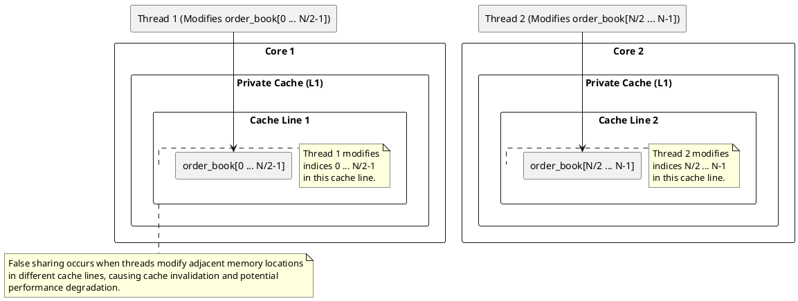

### Scenario 2: Loop Processing with Separate Indices

- Threads process separate parts of an array, but **adjacent elements share the same cache line**.
- Example: Each thread processes a **different index**, but due to cache alignment, they keep invalidating each other's work.

#### Diagram


---

### Code: Parallel Order Book Modification with Potential False Sharing

#### Introduction to the Order Book and Price Level Orders
In financial markets, an **order book** is a real-time list of buy and sell orders for a particular asset. Each order has:
1. **Price**: The price at which the order is placed.
2. **Volume**: The amount of the asset to be bought or sold at the specified price.

Orders are placed at various price levels, and each level represents a price point in the order book.

#### Code Breakdown

```cpp
#include <iostream>
#include <vector>
#include <thread>
#include <atomic>
#include <chrono>

const int NUM_THREADS = 4;  // Number of threads to use for modifying orders

// Structure for representing an order book level
struct OrderBookLevel {  
    int price;    // Price of the order at this level
    int volume;   // Volume of the order at this price level
};

std::vector<OrderBookLevel> order_book;  // Global vector to hold the order book

// Function to modify orders in the order book
void modify_orders(int thread_id) {    
    int start_index = thread_id * (order_book.size() / NUM_THREADS);  // Starting index for the thread's portion
    int end_index = start_index + (order_book.size() / NUM_THREADS);  // Ending index for the thread's portion

    for (int i = start_index; i < end_index; ++i) {
        // Simulating order cancellation or modification
        if (order_book[i].volume > 100) {
            order_book[i].volume -= 100;  // Partial cancellation of orders at this price level
        }
    }
}

int main() { 
    std::vector<std::thread> threads;  // Vector to hold threads

    // Create and start the threads
    for (int i = 0; i < NUM_THREADS; ++i) {
        threads.emplace_back(modify_orders, i);  // Launch threads to modify orders in parallel
    }

    // Join all threads to ensure they complete their execution
    for (auto& t : threads) {
        t.join();
    }

    return 0;
}
```

#### Explanation of the Code:
1. **OrderBookLevel Structure**:
    - Represents a single order in the order book, containing `price` and `volume`.

2. **Global Order Book (`order_book`)**:
    - A vector holding all orders in the order book, with each entry representing an order at a specific price level.

3. **Multithreading and Multicore Processing**:
    - The code leverages **multi-threading** to parallelize the modification of the order book, taking advantage of multicore processors to enhance performance.
    - Each thread modifies a portion of the `order_book` vector independently, reducing the volume of orders by 100 if the volume is greater than 100.

4. **The `modify_orders` Function**:
    - Each thread processes a segment of the order book, determined by `start_index` and `end_index`.
    - It simulates order cancellation or modification by decreasing the volume by 100 (if the volume is greater than 100).

5. **Thread Creation and Joining**:
    - Threads are created using `std::thread` and joined after execution to ensure completion.

#### Possible False Sharing Issue in This Code

**False Sharing** occurs when multiple threads modify variables on the same cache line, even if the variables are logically independent. This causes cache invalidations and reloads, leading to performance degradation.

#### In the Provided Code:
- The `order_book` vector is shared among all threads, and each thread modifies different `OrderBookLevel` objects.
- If adjacent `OrderBookLevel` objects share the same cache line, threads modifying different objects could invalidate the cache line unnecessarily.

For example:
- If `OrderBookLevel[i].price` is modified by one thread and `OrderBookLevel[i+1].volume` is modified by another, both modifications could be on the same cache line.
- This causes **false sharing**, as the cache line is invalidated whenever one thread modifies its data, even though the variables are independent.


## Possible solutions to False Sharing (Ordered by Efficiency)

### 1. Structure of Arrays (SoA) - Most Efficient

Instead of storing **price** and **volume** together in a single structure (Array of Structures), we use **separate arrays** for each field.

#### Example:

```cpp
#include <iostream>
#include <vector>
#include <thread>

const int NUM_THREADS = 4;
const int ORDER_BOOK_SIZE = 1000;

// Separate arrays for prices and volumes
std::vector<int> prices(ORDER_BOOK_SIZE);
std::vector<int> volumes(ORDER_BOOK_SIZE);

void modify_volumes(int thread_id) {
    int start_index = thread_id * (volumes.size() / NUM_THREADS);
    int end_index = start_index + (volumes.size() / NUM_THREADS);

    for (int i = start_index; i < end_index; ++i) {
        if (volumes[i] > 100) {
            volumes[i] -= 100; // Modify only volumes, preventing false sharing
        }
    }
}

int main() {
    std::vector<std::thread> volume_threads;
    
    for (int i = 0; i < NUM_THREADS; ++i) {
        volume_threads.emplace_back(modify_volumes, i);
    }

    for (auto& t : volume_threads) t.join();
    return 0;
}
```

### When SoA May Not Be Applicable:
If **price and volume are tightly coupled** (e.g., volume modifications depend on price), then separating them into different arrays **may not work**. In such cases, other solutions are needed.


### 3. Aligning Data with Padding

Use `alignas(64)` to enforce cache-line alignment.

```cpp
struct alignas(64) OrderBookLevel {  
    int price;    
    int volume;   
    char padding[CACHE_LINE_SIZE - sizeof(int) * 2];  // Padding to ensure isolation in cache

```
1. **`alignas(CACHE_LINE_SIZE)`**: Ensures the struct's starting address aligns with a cache line boundary, preventing multiple threads from accessing the same cache line.  
2. **Explicit Padding `char padding[CACHE_LINE_SIZE - sizeof(int) * 2]`** : Guarantees the struct's size matches the cache line size, avoiding overlap into adjacent cache lines.  
3. **Combination**: For single instances, use both `alignas` and padding to ensure proper alignment and size. For arrays, `alignas` alone suffices, as it ensures proper alignment and size without manual padding.  
4. **Purpose Solved**: Optimizes memory access patterns, reduces cache invalidation, and improves performance in multi-threaded applications.


### 4. Efficient or Smart parittioning using padding after each partition.
```cpp
#include <iostream>
#include <vector>
#include <thread>
#include <span>

const int NUM_THREADS = 4;  // Number of threads to use for modifying orders
const int ORDER_BOOK_SIZE = 1000;  // Size of the order book
const int CACHE_LINE_SIZE = 64;  // Cache line size (in bytes)

// Structure for representing an order book level
struct OrderBookLevel {
    int price;    // Price of the order at this level
    int volume;   // Volume of the order at this price level

// Global vector to hold the order book
std::vector<OrderBookLevel> order_book(ORDER_BOOK_SIZE);

// Function to modify orders in a partition of the order book
void modify_orders(std::span<OrderBookLevel> partition) {
    // Each thread processes its own partition of the order book
    for (auto& level : partition) {
        // Simulating order cancellation or modification
        if (level.volume > 100) {
            level.volume -= 100;  // Partial cancellation of orders at this price level
        }
    }
}

int main() {
    // Example: Initialize order book with some data
    for (int i = 0; i < ORDER_BOOK_SIZE; ++i) {
        order_book[i].price = 100 + i;  // Example price
        order_book[i].volume = 500 + (i % 10) * 10;  // Example volume
    }

    std::vector<std::thread> threads;  // Vector to hold threads

    // Calculate the size of each partition (including padding)
    int base_partition_size = ORDER_BOOK_SIZE / NUM_THREADS;
    int padding_elements = CACHE_LINE_SIZE / sizeof(OrderBookLevel);  // Padding in terms of OrderBookLevel elements
    int partition_size = base_partition_size + padding_elements;

    // Create and start the threads
    for (int i = 0; i < NUM_THREADS; ++i) {
        int start_index = i * base_partition_size;  // Starting index for the thread's partition
        int end_index = start_index + base_partition_size;  // Ending index for the thread's partition

        // Create a span for the partition (including padding at the end)
        std::span<OrderBookLevel> partition(&order_book[start_index], partition_size);

        // Launch threads to modify orders in parallel
        threads.emplace_back(modify_orders, partition);
    }

    // Join all threads to ensure they complete their execution
    for (auto& t : threads) {
        t.join();
    }

    std::cout << "Order book modified successfully." << std::endl;

    return 0;
}
```

```cpp
#include <iostream>
#include <vector>
#include <thread>
#include <span>
#include <cstdint>

const int NUM_THREADS = 4;  // Number of threads
const int ORDER_BOOK_SIZE = 1000;  // Number of actual orders
const int CACHE_LINE_SIZE = 64;  // Cache line size in bytes
const int ELEMENT_SIZE = sizeof(OrderBookLevel);  // Each OrderBookLevel has 2 ints (8 bytes)
const int PADDING_ELEMENTS = CACHE_LINE_SIZE / ELEMENT_SIZE;  // Number of extra elements to pad

// Structure representing an order book level
struct OrderBookLevel {
    int price;
    int volume;
};

// Global order book with padding after each partition
std::vector<OrderBookLevel> order_book(ORDER_BOOK_SIZE + (NUM_THREADS * PADDING_ELEMENTS));

// Function to modify orders using std::span, operating on partitioned data
void modify_orders(std::span<OrderBookLevel> partition) {
    for (auto& level : partition) {
        if (level.volume > 100) {
            level.volume -= 100;
        }
    }
}

int main() {
    // Initialize order book with example data
    for (int i = 0; i < ORDER_BOOK_SIZE; ++i) {
        order_book[i].price = 100 + i;
        order_book[i].volume = 500 + (i % 10) * 10;
    }

    std::vector<std::thread> threads;
    int partition_size = ORDER_BOOK_SIZE / NUM_THREADS;

    for (int i = 0; i < NUM_THREADS; ++i) {
        int start_index = i * (partition_size + PADDING_ELEMENTS); // Include padding
        int end_index = start_index + partition_size; // Exclude padding

        // Create a span covering only the partition, NOT the padding
        std::span<OrderBookLevel> partition(order_book.data() + start_index, partition_size);

        threads.emplace_back(modify_orders, partition);
    }

    for (auto& t : threads) {
        t.join();
    }

    std::cout << "Order book modified successfully." << std::endl;
    return 0;
}
```


### 5. Using Local Buffers and Merging Results
Each thread processes data in its **local buffer**, then merges it back after completion.

Ah, I see! You're asking for a solution where each thread works on a **local buffer** and then merges the results back into the shared global data. This method can help reduce false sharing, as each thread operates on its own local copy of the data, avoiding the cache-line conflicts that would arise if threads directly modified the shared `order_book`.

Here's an efficient version of the buffering solution that **does not require alignment** and follows the **local buffer and merging** approach:

### Updated Code Using Local Buffers and Merging

```cpp
#include <iostream>
#include <vector>
#include <thread>
#include <atomic>
#include <chrono>

const int NUM_THREADS = 4;  // Number of threads to use for modifying orders
const int ORDER_BOOK_SIZE = 1000;  // Size of the order book

// Structure for representing an order book level
struct OrderBookLevel {
    int price;    // Price of the order at this level
    int volume;   // Volume of the order at this price level
};

// Global vector to hold the order book
std::vector<OrderBookLevel> order_book(ORDER_BOOK_SIZE);

// Function to modify orders in a local buffer, then merge them back
void modify_orders(int thread_id) {
    // Local buffer for the thread
    std::vector<OrderBookLevel> local_buffer(ORDER_BOOK_SIZE / NUM_THREADS);

    // Determine which portion of the order book the thread is responsible for
    int start_index = thread_id * (ORDER_BOOK_SIZE / NUM_THREADS);  // Starting index for the thread's portion
    int end_index = start_index + (ORDER_BOOK_SIZE / NUM_THREADS);  // Ending index for the thread's portion

    // Each thread processes its own local buffer (work is done on the local copy)
    for (int i = start_index; i < end_index; ++i) {
        local_buffer[i - start_index] = order_book[i];  // Copy the data into the local buffer

        // Simulating order cancellation or modification
        if (local_buffer[i - start_index].volume > 100) {
            local_buffer[i - start_index].volume -= 100;  // Partial cancellation of orders at this price level
        }
    }

    // After local processing, merge the results back into the main order book
    for (int i = start_index; i < end_index; ++i) {
        order_book[i] = local_buffer[i - start_index];  // Copy the modified data back to the global order book
    }
}

int main() {
    // Example: Initialize order book with some data
    for (int i = 0; i < ORDER_BOOK_SIZE; ++i) {
        order_book[i].price = 100 + i;  // Example price
        order_book[i].volume = 500 + (i % 10) * 10;  // Example volume
    }

    std::vector<std::thread> threads;  // Vector to hold threads

    // Create and start the threads
    for (int i = 0; i < NUM_THREADS; ++i) {
        threads.emplace_back(modify_orders, i);  // Launch threads to modify orders in parallel
    }

    // Join all threads to ensure they complete their execution
    for (auto& t : threads) {
        t.join();
    }

    std::cout << "Order book modified successfully." << std::endl;

    return 0;
}
```

### Explanation of Changes:

1. **Local Buffer**: Each thread operates on a **local buffer** (a temporary copy of its portion of the `order_book`). This avoids direct modification of the global `order_book` and reduces contention between threads. Each thread works on its own isolated buffer, thus preventing cache invalidation across threads.

2. **Merging Results**: After the thread has processed its portion of the data in the local buffer, the changes are merged back into the main `order_book`. This is done after the local processing to minimize conflicts between threads when accessing the shared global data.

3. **Avoiding False Sharing**: Since each thread works on a copy of the data, false sharing is avoided. Threads only write back to the global array once they are finished processing, so there is no need to worry about multiple threads modifying the same memory locations at the same time.

### Why This Works:

- **Local Buffers**: By using local buffers, threads don’t directly operate on the global `order_book`. This reduces the need for synchronization mechanisms like locks, as threads don’t step on each other’s data.
  
- **Efficient Merging**: The merging step happens only once at the end of the computation, minimizing the performance overhead from accessing shared data. This ensures that the threads' local work doesn’t interfere with each other during processing.

- **No False Sharing**: Since the threads work on separate chunks of the `order_book` (in their local buffers), there is no danger of false sharing, even though the data might be accessed or modified in parallel.

### Conclusion:
This solution is **false-sharing safe**
