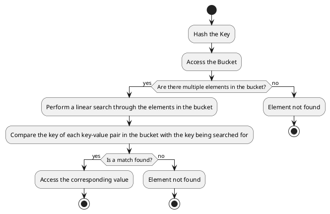

# Hashtable Overview
- **Hashtable**: A data structure that stores key-value pairs.
- **Fixed Array of Buckets**: Initially, the hashtable consists of a fixed array of buckets.
- **Buckets**: Each bucket can be implemented as a linked list, dynamic array, or other structures to handle collisions.

## Key Concepts

1. **Buckets**:
   - Each key is processed by a hash function to produce a hash code.
   - The hash code determines which bucket the key-value pair will be stored in.
   - Multiple keys can generate the same hash code, leading to collisions.
   - Collisions are handled within the same bucket (e.g., using a linked list or dynamic array).

2. **Load Factor**:
   - Measures how full the hashtable is.
   - Formula: \(\text{Load Factor} = \frac{\text{Number of Elements}}{\text{Number of Buckets}}\)
   - A higher load factor increases the likelihood of collisions.
   - Example: With 5 elements and 5 buckets, the load factor is \(\frac{5}{5} = 1.0\).
   **What is load factor and how it is calculated ?**
   The **load factor** is a measure that indicates how full a hash table is.
   It's calculated by taking the number of elements in the hash table and dividing it by the number of slots (or buckets) available in the table.
   Load factor = (Number of elements in the hash table) / (Number of slots or buckets in the hash table)
   A higher load factor means the hash table is more filled, which could lead to more collisions.
   Keeping the load factor low is generally preferred to reduce the likelihood of collisions and maintain efficient performance of the hash table operations..

3. **Threshold**:
   - Determines when the hashtable needs to be resized.
   - Formula: \(\text{Threshold} = \text{Initial Capacity} \times \text{Load Factor}\)
   - Example: For an initial capacity of 5 buckets and a load factor of 0.75, the threshold is \(5 \times 0.75 = 3\).

4. **Resizing**:
   - Triggered when the number of elements exceeds the threshold.
   - Typically involves doubling the capacity of the array of buckets.
   - All existing elements are rehashed and placed into the new buckets to reduce the load factor.

## Example Walkthrough

### Initial Setup
- Hashtable with 5 buckets.
- Keys and Values: `apple` (1), `banana` (2), `cherry` (3), `date` (4), `elderberry` (5).

## Bucket Index Calculation
1. `apple` -> Bucket 0
2. `banana` -> Bucket 4
3. `cherry` -> Bucket 3
4. `date` -> Bucket 4 (collision with `banana`)
5. `elderberry` -> Bucket 2

## Initial Hashtable
```
Buckets:
   [0] -> ("apple", 1)
   [1] -> Empty
   [2] -> ("elderberry", 5)
   [3] -> ("cherry", 3)
   [4] -> ("banana", 2) -> ("date", 4)  // Collision handled by linked list
```

### Load Factor
\(\text{Load Factor} = \frac{5}{5} = 1.0\)

### Threshold Calculation
- Initial Capacity: 5
- Load Factor: 0.75
- Threshold: \(5 \times 0.75 = 3\)

### Resized Hashtable (Capacity doubled to 10)
```
Buckets (New Capacity: 10):
   [0] -> ("apple", 1)
   [1] -> Empty
   [2] -> Empty
   [3] -> Empty
   [4] -> ("elderberry", 5)
   [5] -> Empty
   [6] -> Empty
   [7] -> Empty
   [8] -> ("cherry", 3)
   [9] -> ("banana", 2) -> ("date", 4)  // Collision handled by linked list
```

This summary captures the essence of how hashtables work, including bucket allocation, load factor, threshold, and resizing. Save this for your reference, and let me know if you need further clarification! 📘📊

# unordered_map
## The implementation and memory representation of `unordered_map` in the C++ Standard Template Library (STL):

**Storage**: 
An `unordered_map` is essentially a hash table, which is an array of buckets.
Each bucket can contain zero or more key-value pairs.
**NOTE** It stores key-value pairs and not only values. As when there is collision , the resolution requires key to compare and find the exact element.

**Hashing**:
When an element is inserted into the `unordered_map`, its key is hashed to determine the index of the bucket where it should be stored.
If multiple keys hash to the same index, they are all stored in the same bucket.

**Bucket Data Structure**: 
Each bucket is typically implemented as a linked list (or similar data structure) of structures (or pairs), each containing a key and its associated value.

**Iteration**:
Iteration over an `unordered_map` proceeds through each bucket in the array, and for each bucket, through each element in the bucket.
The order of iteration is not the order of insertion, and is not predictable.

**Invalidation by Insertion**:
If an insertion causes the `unordered_map` to rehash its elements (which happens when the load factor exceeds a certain threshold), all iterators to elements in the `unordered_map` are invalidated.
This is because rehashing involves allocating a new array of buckets and moving the elements from the old array to the new one, which can cause them to be located at different addresses in memory.

**Insertion/Deletion**:
Insertion involves hashing the key, locating the appropriate bucket, and adding a new element to that bucket.
Deletion involves hashing the key, locating the appropriate bucket, and removing the element from that bucket.
Both operations can be done in constant time on average, but in the worst case (when all keys hash to the same index), they can take linear time.

## The determination of the initial size and the condition to resize an `unordered_map` in the C++ Standard Template Library (STL):

**Initial Size**: The initial size of the hashtable in an `unordered_map` is implementation-defined, which means it can vary between different compilers or versions of the STL.
   However, it's typically chosen to be a small size that offers a good balance between memory usage and performance.

2. **Condition to Resize**: The hashtable in an `unordered_map` is resized when the load factor (the number of elements divided by the number of buckets) exceeds a certain threshold.
   This threshold is also implementation-defined, but a common choice is 1.0, meaning the hashtable is resized when the number of elements equals the number of buckets.
       - **Load Factor Calculation**: The STL `unordered_map` keeps track of the number of elements and the number of buckets, so it can calculate the load factor in constant time, without needing to iterate over the elements.
         When an element is inserted, the `unordered_map` increments its count of elements and then checks if the load factor exceeds the threshold.

3. **Resizing Process**: When the `unordered_map` is resized, it allocates a new array of buckets that is typically at least twice the size of the old array.
   Then, it rehashes each element in the old array and inserts it into the new array.
   This can cause the elements to be located at different addresses in memory, which is why all iterators to elements in the `unordered_map` are invalidated when it is resized.

4. **Amortized Cost of Resizing**: While the resizing operation can be expensive when it happens, it happens infrequently enough that the cost is spread out over many insertions. As a result, the average cost of an insertion is still constant time.

## Breakdown of the search process in an `unordered_map` when collisions occur:

1. **Hash the Key**: The key of the element to be searched is hashed using the same hash function used by the `unordered_map`.
   This gives the index of the bucket where the element would be located if it is present in the `unordered_map`.

2. **Access the Bucket**: The bucket at the calculated index is accessed.
   This operation is O(1), or constant time, because accessing an element in an array by its index is a constant time operation.

3. **Search the Bucket**: If there are multiple elements in the bucket (due to collisions), a linear search is performed through the elements in the bucket.
   This is where the key-value pairs are compared.

    - **Key Comparison**: The key of each key-value pair in the bucket is compared with the key being searched for.
      If a match is found, that means the element has been found.

    - **Value Access**: If the keys match, the corresponding value can be accessed.
      Note that the value isn't used in the search operation; it's the key that determines if the correct element has been found.

    The time complexity of the search operation is O(n), where n is the number of elements in the bucket.
    This is because in the worst-case scenario (when all keys hash to the same index), a linear search through all the elements would be necessary.

### A PlantUML activity diagram representation for the search process in an unordered_map:


### A simple code snippet to illustrate the search operation:

```cpp
std::unordered_map<std::string, int> map;
map["key1"] = 1;
map["key2"] = 2;  // Assume "key2" hashes to the same index as "key1"

std::string keyToSearch = "key1";
auto it = map.find(keyToSearch);
if (it != map.end()) {
    std::cout << "Found " << it->first << ": " << it->second << "\n";
} else {
    std::cout << "Did not find " << keyToSearch << "\n";
}
```

In this code, `map.find(keyToSearch)` returns an iterator to the element with key `keyToSearch` if it is found, or `map.end()` if it is not found.
The key-value pair can be accessed through the iterator `it`.

`std::unordered_map` in C++ is a hash table-based container that provides fast access to elements. It uses an underlying hashtable to store key-value pairs and manage collisions. The concepts of load factor and threshold are integral to its implementation.

## Load Factor, Threshold and resize in std::unordered_map
In `std::unordered_map`, the load factor is the ratio of the number of elements to the number of buckets. It's calculated similarly to our earlier example:

\[
\text{Load Factor} = \frac{\text{Number of Elements}}{\text{Number of Buckets}}
\]

You can retrieve the load factor of an `unordered_map` using the `load_factor()` method:

```cpp
std::unordered_map<int, int> my_map;
// Add some elements...
float load_factor = my_map.load_factor();
```

### Maximum Load Factor
The maximum load factor determines when the hashtable needs to be resized to maintain efficient performance. It's a predefined constant that can be adjusted using the `max_load_factor()` method. By default, this value is usually set to 1.0, but it can be changed if needed:

```cpp
my_map.max_load_factor(0.75); // Set maximum load factor to 0.75
```

### Threshold and Resizing
The threshold for resizing is based on the product of the maximum load factor and the current number of buckets. When the actual load factor exceeds the maximum load factor, the hashtable resizes to maintain performance. This resizing typically involves rehashing the elements and increasing the number of buckets.

### Example
Here's a simple example to demonstrate how load factor and maximum load factor work in `std::unordered_map`:

```cpp
#include <iostream>
#include <unordered_map>

int main() {
    std::unordered_map<int, int> my_map;

    // Adding elements
    my_map[1] = 100;
    my_map[2] = 200;
    my_map[3] = 300;

    // Print current load factor
    std::cout << "Load factor: " << my_map.load_factor() << std::endl;

    // Set and print maximum load factor
    my_map.max_load_factor(0.75);
    std::cout << "Max load factor: " << my_map.max_load_factor() << std::endl;

    // Adding more elements to exceed the threshold and trigger resizing
    for (int i = 4; i <= 10; ++i) {
        my_map[i] = i * 100;
    }

    // Print load factor after resizing
    std::cout << "Load factor after resizing: " << my_map.load_factor() << std::endl;

    return 0;
}
```

### Explanation
1. **Initial Load Factor**: Calculated based on the initial elements and number of buckets.
2. **Setting Max Load Factor**: Adjusting the maximum load factor to 0.75.
3. **Resizing**: Adding more elements to exceed the threshold, triggering the resizing and rehashing process.

By managing the load factor and threshold, `std::unordered_map` ensures efficient performance even as the number of elements grows.


## Iterators to elements in an unordered_map may be invalidated by insertions?
This is true. According to the C++ Standard, insertions into an unordered_map can invalidate iterators if rehashing occurs.

# Hashing and `std::hash` Summary

## What is Hashing?
Hashing is the process of converting an input (or key) into a fixed-size string of bytes, typically using a hash function. The output, known as the hash code, is used to index into an array of buckets, allowing for efficient data retrieval.

## `std::hash`
`std::hash` is a template class in C++'s Standard Library used to generate hash values for objects. It provides default implementations for many standard types, but can also be specialized for custom types.

### Default Implementation
The `std::hash` class template provides default hash functions for built-in types such as `int`, `float`, and `std::string`.

**Example:**
```cpp
#include <iostream>
#include <functional>
#include <string>

int main() {
    std::hash<int> hash_int;
    std::hash<std::string> hash_string;

    int int_value = 42;
    std::string str_value = "Hello";

    std::size_t hash_int_value = hash_int(int_value);
    std::size_t hash_string_value = hash_string(str_value);

    std::cout << "Hash value for int: " << hash_int_value << std::endl;
    std::cout << "Hash value for string: " << hash_string_value << std::endl;

    return 0;
}
```

**Expected Output:**
```
Hash value for int: 42
Hash value for string: 69609650
```

### Custom Type Specialization
You can specialize `std::hash` for custom types by defining a template specialization. This allows `std::unordered_map` and `std::unordered_set` to use your custom type as a key or element.

**Example:**
```cpp
#include <iostream>
#include <unordered_map>
#include <unordered_set>
#include <string>

struct Person {
    std::string first_name;
    std::string last_name;
    int age;

    bool operator==(const Person& other) const {
        return first_name == other.first_name &&
               last_name == other.last_name &&
               age == other.age;
    }
};

// Specializing std::hash for Person
namespace std {
    template<>
    struct hash<Person> {
        std::size_t operator()(const Person& p) const {
            std::size_t h1 = std::hash<std::string>{}(p.first_name);
            std::size_t h2 = std::hash<std::string>{}(p.last_name);
            std::size_t h3 = std::hash<int>{}(p.age);
            return h1 ^ (h2 << 1) ^ (h3 << 2); // Simple combination technique
        }
    };
}

int main() {
    Person p1{"John", "Doe", 30};

    // Using p1 in std::unordered_map
    std::unordered_map<Person, std::string> person_map;
    person_map[p1] = "Engineer";

    // Using p1 in std::unordered_set
    std::unordered_set<Person> person_set;
    person_set.insert(p1);

    std::cout << "Person Map:" << std::endl;
    for (const auto& entry : person_map) {
        std::cout << entry.first.first_name << " " << entry.first.last_name
                  << ": " << entry.second << std::endl;
    }

    std::cout << "\nPerson Set:" << std::endl;
    for (const auto& person : person_set) {
        std::cout << person.first_name << " " << person.last_name << " (Age: "
                  << person.age << ")" << std::endl;
    }

    return 0;
}
```

**Expected Output:**
```
Person Map:
John Doe: Engineer
Jane Smith: Doctor

Person Set:
John Doe (Age: 30)
Jane Smith (Age: 25)
```

## Why Overload the `==` Operator?

### Purpose
Overloading the equality (`==`) operator in the struct used for hashing is crucial for the proper functioning of `std::unordered_map` and `std::unordered_set`.

### Usage
1. **Inserting Elements**: To ensure that no duplicate keys or elements are added.
2. **Retrieving Elements**: To locate the correct key-value pair or element.
3. **Removing Elements**: To find and remove the specific key or element.

When `std::unordered_map` or `std::unordered_set` performs an operation that requires comparing elements, it uses the equality operator to determine if two elements are considered equal. For instance, when you insert a new element, the container needs to check if an equivalent element already exists.

**Code Visualization:**
```cpp
bool operator==(const Person& other) const {
    return first_name == other.first_name &&
           last_name == other.last_name &&
           age == other.age;
}
```

## Key Takeaways
1. **Hashing**: Converts keys into hash codes for efficient indexing.
2. **`std::hash`**: Provides default hash functions and can be specialized for custom types.
3. **Equality Operator**: Ensures correct comparison of keys in hash-based containers.


## Differences between `std::hash` functions and cryptographic hash functions:

1. **Calculation**:
   - `std::hash`        : Designed for speed, it quickly computes a hash value that helps in placing an object in a hash table.
   - Cryptographic hash : Computes a hash value in a way that makes it extremely difficult to reverse-engineer or find collisions. It's more complex and involves multiple rounds of processing.

2. **Complexity**:
   - `std::hash`        : Generally has lower computational complexity and is faster.
   - Cryptographic hash : Has higher computational complexity due to its design to be secure against cryptographic attacks.

3. **Insertion/Deletion Cost (Runtime Cost of Calculation)**:
   - `std::hash`        : Lower cost, as it's optimized for quick insertions and deletions in hash-based containers like `std::unordered_map` and `std::unordered_set`⁷.
   - Cryptographic hash : Higher cost, as the secure computation takes more time and resources.

4. **Search Cost (Probe/Search Efficiency)**:
   - `std::hash`        : High efficiency in searching, as it's designed to minimize collisions in a typical use-case scenario.
   - Cryptographic hash : While also efficient, the primary goal is security rather than speed, which can affect search efficiency.

5. **Different Hash Functions Provided in std**:
   - `std::hash` is part of the C++ Standard Library and provides hash functions for fundamental types and some library types.
     Provides a basic hash function for various data types like integers, strings, etc.
     Can be specialized for custom types by overloading the `operator()` function.

6. **Available Cryptographic Hash Functions in std and Other Third-Party Libraries**:
   - The C++ Standard Library (`std`) does not provide cryptographic hash functions.
     However, third-party libraries like OpenSSL, Botan, and Crypto++ offer a variety of cryptographic hash functions, including SHA-256, SHA-3, and others.

In summary, `std::hash` is suitable for general-purpose use in hash tables where the emphasis is on speed and efficiency.
Cryptographic hash functions are used when security is paramount, such as in password hashing or digital signatures, where the ability to withstand cryptographic attacks is critical.
Third-party libraries are needed to use cryptographic hash functions in C++ as they are not part of the standard library.

### For a cryptographic hash function, you might use a library like OpenSSL and hash the serialized representation of the order:
In the cryptographic example, we concatenate the string representations of the members and then compute the SHA-256 hash of the resulting string.

```cpp
#include <openssl/sha.h>
#include <sstream>
#include <iomanip>

std::string hashOrder(const Order& order) {
    std::ostringstream oss;
    oss << order.sym << order.qty << order.ask << order.bid;
    std::string orderStr = oss.str();

    unsigned char hash[SHA256_DIGEST_LENGTH];
    SHA256_CTX sha256;
    SHA256_Init(&sha256);
    SHA256_Update(&sha256, orderStr.c_str(), orderStr.size());
    SHA256_Final(hash, &sha256);

    std::stringstream ss;
    for(int i = 0; i < SHA256_DIGEST_LENGTH; i++) {
        ss << std::hex << std::setw(2) << std::setfill('0') << (int)hash[i];
    }
    return ss.str();
}
```
## What is identity hash?
In the context of hashing, an identity hash refers to a method where the hash value of an object is simply the object's memory address.
This means the hash function essentially returns the pointer value of the object itself.

**Beakdown of identity hash:***

**Concept:**
* Instead of performing any calculations to generate a unique hash value, the object's memory address is used directly.
* This approach assumes that objects residing at different memory locations are guaranteed to be distinct.

**Use Cases:**
* Identity hash is rarely used in general-purpose hashing scenarios due to its limitations.
* It might be used in specific situations where object identity is more important than content-based comparisons.
* For example, it could be used in certain internal data structures where quick object lookup based on memory address is necessary.

**Limitations:**
* **Non-Uniqueness:**
    If two objects have the same content but reside at different memory locations, they will have different identity hashes.
    This can lead to collisions and incorrect lookups.
* **Memory-Dependence:**
    The hash value depends on the object's memory address, which can change if the object is moved in memory due to reallocation or garbage collection.
    This makes identity hash unreliable for persistent storage or distributed systems.

**Alternatives:**
* In most cases, it's preferable to use standard hashing functions that calculate a hash value based on the object's actual content.
  This ensures uniqueness even if objects have the same memory address.

**Summary:**
Identity hash is a simple but limited hashing approach. While it might be suitable for niche cases where object identity is paramount, it's generally not recommended for general-purpose hashing due to its lack of uniqueness and memory dependence.

# Prime numbers play a significant role in hashing for several reasons:

### 1. Reducing Collisions
Using prime numbers in hash functions helps distribute hash codes more uniformly across the buckets, reducing the likelihood of collisions (when multiple keys hash to the same bucket). A uniform distribution ensures that elements are spread out evenly, which improves the efficiency of the hashtable.
This is because prime numbers have fewer factors (divisors) other than 1 and itself.

### 2. Hash Function Design
Prime numbers are often used in the design of hash functions to produce more unique and distributed hash values. For instance, when using a hash function like the multiplicative hash function, a prime number is used as a multiplier to minimize patterns in the input data, leading to a more even distribution of hash codes.

### 3. Table Size (prime-number bucket counts) :
Choosing a prime number for the size of the hashtable (i.e., the number of buckets) can also help in achieving a better distribution of hash values. This is particularly useful in open addressing schemes (like linear probing) where the table size being a prime number helps in covering all possible indices in the table.
**Real-World Scenario:**
* In practice, `std::unordered_map` and `std::unordered_set` implementations often use a dynamic resizing strategy.
* The initial bucket count might not be a prime number, but it can be resized to a prime number or another suitable value as the number of elements grows.
* However, `std::unordered_containers` are not strictly limited to using prime numbers for bucket counts.

### Example
Let's illustrate this with a simple hash function:

**Non-prime table size:**
```cpp
std::size_t hash_function(int key, std::size_t table_size) {
    return key % table_size;
}

std::size_t table_size = 10; // Not a prime number
std::size_t hash_value = hash_function(12345, table_size);
```

**Prime table size:**
```cpp
std::size_t hash_function(int key, std::size_t table_size) {
    return key % table_size;
}

std::size_t table_size = 11; // Prime number
std::size_t hash_value = hash_function(12345, table_size);
```

Using a prime number for the table size often results in a more uniform distribution of hash values.

### Summary
Prime numbers are significant in hashing because they help in:
- Reducing collisions.
- Designing effective hash functions.
- Choosing an optimal table size.

This ensures that the hashtable operates efficiently, providing fast access, insertion, and deletion times.

## Why Not Always Use Prime Numbers?**
* While prime numbers offer some benefits, they're not always the best choice.
* In some cases, using a power of 2 (e.g., 2^n) for the bucket count might be more efficient due to hardware optimizations for memory access patterns.
* The C++ standard doesn't mandate the use of prime numbers, leaving the implementation details to the compiler or library vendor.

# Collision Resolution Schemes.
## Open Addressing
### Linear Probing

#### Initial Setup
- Hash table with an initial capacity of 5 buckets (indices 0 to 4).
- Simple hash function: \( \text{Bucket Index} = \text{Key} \% 5 \).
- Load factor threshold set to 0.75.

#### Keys and Values
We'll use the following keys: `7`, `12`, `14`, `17`, `23`, `3`, `8`, `18`.

#### Threshold Calculation
- Initial Capacity: 5 buckets
- Load Factor Threshold: 0.75
- Threshold: \( 5 \times 0.75 = 3.75 \approx 3 \)

When the number of elements exceeds 3, the hashtable will resize.

#### Steps Before Resizing
1. **Inserting Key `7`**:
   - Hash: \( 7 \% 5 = 2 \)
   - Bucket 2 is empty, so insert `7` into Bucket 2.
   
   ```
   Buckets:
   [0] -> Empty
   [1] -> Empty
   [2] -> 7
   [3] -> Empty
   [4] -> Empty
   ```

2. **Inserting Key `12`**:
   - Hash: \( 12 \% 5 = 2 \)
   - Collision at Bucket 2. Check next bucket sequentially.
   - Bucket 3 is empty, so insert `12` into Bucket 3.
   
   ```
   Buckets:
   [0] -> Empty
   [1] -> Empty
   [2] -> 7
   [3] -> 12
   [4] -> Empty
   ```

3. **Inserting Key `14`**:
   - Hash: \( 14 \% 5 = 4 \)
   - Bucket 4 is empty, so insert `14` into Bucket 4.
   
   ```
   Buckets:
   [0] -> Empty
   [1] -> Empty
   [2] -> 7
   [3] -> 12
   [4] -> 14
   ```

#### Resizing Triggered
Since the number of elements exceeds the threshold (3), the hashtable resizes. Let's double the capacity to 10 buckets and rehash all existing elements.

#### Rehashing After Resizing
The new hash table has 10 buckets (indices 0 to 9).

1. **Rehash Key `7`**:
   - New Hash: \( 7 \% 10 = 7 \)
   - Insert `7` into Bucket 7.

2. **Rehash Key `12`**:
   - New Hash: \( 12 \% 10 = 2 \)
   - Insert `12` into Bucket 2.

3. **Rehash Key `14`**:
   - New Hash: \( 14 \% 10 = 4 \)
   - Insert `14` into Bucket 4.

#### Continuing Insertion After Resizing
Now we can insert the remaining keys: `17`, `23`, `3`, `8`, `18`.

4. **Inserting Key `17`**:
   - New Hash: \( 17 \% 10 = 7 \)
   - Collision at Bucket 7. Check next bucket sequentially.
   - Bucket 8 is empty, so insert `17` into Bucket 8.
   
   ```
   Buckets:
   [0] -> Empty
   [1] -> Empty
   [2] -> 12
   [3] -> Empty
   [4] -> 14
   [5] -> Empty
   [6] -> Empty
   [7] -> 7
   [8] -> 17
   [9] -> Empty
   ```

5. **Inserting Key `23`**:
   - New Hash: \( 23 \% 10 = 3 \)
   - Insert `23` into Bucket 3.
   
   ```
   Buckets:
   [0] -> Empty
   [1] -> Empty
   [2] -> 12
   [3] -> 23
   [4] -> 14
   [5] -> Empty
   [6] -> Empty
   [7] -> 7
   [8] -> 17
   [9] -> Empty
   ```

6. **Inserting Key `3`**:
   - New Hash: \( 3 \% 10 = 3 \)
   - Collision at Bucket 3. Check next bucket sequentially.
   - Bucket 4 is occupied by `14`. Check next bucket.
   - Bucket 5 is empty, so insert `3` into Bucket 5.
   
   ```
   Buckets:
   [0] -> Empty
   [1] -> Empty
   [2] -> 12
   [3] -> 23
   [4] -> 14
   [5] -> 3
   [6] -> Empty
   [7] -> 7
   [8] -> 17
   [9] -> Empty
   ```

7. **Inserting Key `8`**:
   - New Hash: \( 8 \% 10 = 8 \)
   - Collision at Bucket 8. Check next bucket sequentially.
   - Bucket 9 is empty, so insert `8` into Bucket 9.
   
   ```
   Buckets:
   [0] -> Empty
   [1] -> Empty
   [2] -> 12
   [3] -> 23
   [4] -> 14
   [5] -> 3
   [6] -> Empty
   [7] -> 7
   [8] -> 17
   [9] -> 8
   ```

8. **Inserting Key `18`**:
   - New Hash: \( 18 \% 10 = 8 \)
   - Collision at Bucket 8. Check next bucket sequentially.
   - Bucket 9 is occupied by `8`. Check next bucket.
   - Bucket 0 is empty, so insert `18` into Bucket 0.
   
   ```
   Buckets:
   [0] -> 18
   [1] -> Empty
   [2] -> 12
   [3] -> 23
   [4] -> 14
   [5] -> 3
   [6] -> Empty
   [7] -> 7
   [8] -> 17
   [9] -> 8
   ```

#### Visual Representation After Resizing
Here's the final state of the hash table after resizing and rehashing:

```
Buckets:
[0] -> 18
[1] -> Empty
[2] -> 12
[3] -> 23
[4] -> 14
[5] -> 3
[6] -> Empty
[7] -> 7
[8] -> 17
[9] -> 8
```

#### Summary
- **Resizing**: Triggered when the number of elements exceeds the load factor threshold (3 in this case).
- **Rehashing**: Recalculates the hash for all existing elements and places them into the new, larger table.

This extended example demonstrates how linear probing handles collisions and how resizing ensures the hashtable remains efficient as more elements are added.

### Quadratic Probing
Quadratic probing is an open addressing collision resolution method where, when a collision occurs, the algorithm searches for the next available slot using a quadratic function. The probing sequence is given by:
\[ \text{New Index} = (\text{Original Index} + i^2) \% \text{Table Size} \]
where \( i \) is the number of attempts to resolve the collision.

#### Initial Setup
- We have a hash table with 5 buckets (indices 0 to 4).
- Simple hash function: \( \text{Bucket Index} = \text{Key} \% 5 \).
- Load factor threshold set to 0.75.

#### Keys and Values
We'll use the following keys: `7`, `12`, `14`, `17`, `23`, `3`, `8`, `18`.
#### Threshold Calculation
- Initial Capacity: 5 buckets
- Load Factor Threshold: 0.75
- Threshold: \( 5 \times 0.75 = 3.75 \approx 3 \)

When the number of elements exceeds 3, the hashtable will resize.

#### Steps Before Resizing
1. **Inserting Key `7`**:
   - Hash: \( 7 \% 5 = 2 \)
   - Bucket 2 is empty, so insert `7` into Bucket 2.
   
   ```
   Buckets:
   [0] -> Empty
   [1] -> Empty
   [2] -> 7
   [3] -> Empty
   [4] -> Empty
   ```

2. **Inserting Key `12`**:
   - Hash: \( 12 \% 5 = 2 \)
   - Collision at Bucket 2. Check next bucket using quadratic probing.
   - New Index: \( (2 + 1^2) \% 5 = 3 \)
   - Bucket 3 is empty, so insert `12` into Bucket 3.
   
   ```
   Buckets:
   [0] -> Empty
   [1] -> Empty
   [2] -> 7
   [3] -> 12
   [4] -> Empty
   ```

3. **Inserting Key `14`**:
   - Hash: \( 14 \% 5 = 4 \)
   - Bucket 4 is empty, so insert `14` into Bucket 4.
   
   ```
   Buckets:
   [0] -> Empty
   [1] -> Empty
   [2] -> 7
   [3] -> 12
   [4] -> 14
   ```

#### Resizing Triggered
Since the number of elements exceeds the threshold (3), the hashtable resizes. Let's double the capacity to 10 buckets and rehash all existing elements.

##### Rehashing After Resizing
The new hash table has 10 buckets (indices 0 to 9).

1. **Rehash Key `7`**:
   - New Hash: \( 7 \% 10 = 7 \)
   - Insert `7` into Bucket 7.

2. **Rehash Key `12`**:
   - New Hash: \( 12 \% 10 = 2 \)
   - Insert `12` into Bucket 2.

3. **Rehash Key `14`**:
   - New Hash: \( 14 \% 10 = 4 \)
   - Insert `14` into Bucket 4.

#### Continuing Insertion After Resizing
Now we can insert the remaining keys: `17`, `23`, `3`, `8`, `18`.

4. **Inserting Key `17`**:
   - New Hash: \( 17 \% 10 = 7 \)
   - Collision at Bucket 7. Check next bucket using quadratic probing.
   - New Index: \( (7 + 1^2) \% 10 = 8 \)
   - Bucket 8 is empty, so insert `17` into Bucket 8.
   
   ```
   Buckets:
   [0] -> Empty
   [1] -> Empty
   [2] -> 12
   [3] -> Empty
   [4] -> 14
   [5] -> Empty
   [6] -> Empty
   [7] -> 7
   [8] -> 17
   [9] -> Empty
   ```

5. **Inserting Key `23`**:
   - New Hash: \( 23 \% 10 = 3 \)
   - Insert `23` into Bucket 3.
   
   ```
   Buckets:
   [0] -> Empty
   [1] -> Empty
   [2] -> 12
   [3] -> 23
   [4] -> 14
   [5] -> Empty
   [6] -> Empty
   [7] -> 7
   [8] -> 17
   [9] -> Empty
   ```

6. **Inserting Key `3`**:
   - New Hash: \( 3 \% 10 = 3 \)
   - Collision at Bucket 3. Check next bucket using quadratic probing.
   - New Index: \( (3 + 1^2) \% 10 = 4 \)
   - Bucket 4 is occupied by `14`. Check next bucket using quadratic probing.
   - New Index: \( (3 + 2^2) \% 10 = 7 \)
   - Bucket 7 is occupied by `7`. Check next bucket using quadratic probing.
   - New Index: \( (3 + 3^2) \% 10 = 2 \)
   - Bucket 2 is occupied by `12`. Check next bucket using quadratic probing.
   - New Index: \( (3 + 4^2) \% 10 = 9 \)
   - Bucket 9 is empty, so insert `3` into Bucket 9.
   
   ```
   Buckets:
   [0] -> Empty
   [1] -> Empty
   [2] -> 12
   [3] -> 23
   [4] -> 14
   [5] -> Empty
   [6] -> Empty
   [7] -> 7
   [8] -> 17
   [9] -> 3
   ```

7. **Inserting Key `8`**:
   - New Hash: \( 8 \% 10 = 8 \)
   - Collision at Bucket 8. Check next bucket using quadratic probing.
   - New Index: \( (8 + 1^2) \% 10 = 9 \)
   - Bucket 9 is occupied by `3`. Check next bucket using quadratic probing.
   - New Index: \( (8 + 2^2) \% 10 = 2 \)
   - Bucket 2 is occupied by `12`. Check next bucket using quadratic probing.
   - New Index: \( (8 + 3^2) \% 10 = 7 \)
   - Bucket 7 is occupied by `7`. Check next bucket using quadratic probing.
   - New Index: \( (8 + 4^2) \% 10 = 4 \)
   - Bucket 4 is occupied by `14`. Check next bucket using quadratic probing.
   - New Index: \( (8 + 5^2) \% 10 = 3 \)
   - Bucket 3 is occupied by `23`. Check next bucket using quadratic probing.
   - The quadratic probing sequence cycles back, and the table is full. `8` cannot be inserted.
   
8. **Inserting Key `18`**:
   - New Hash: \( 18 \% 10 = 8 \)
   - Similar probing sequence as key `8`, and the table is full. `18` cannot be inserted.

#### Visual Representation After Resizing
Here's the final state of the hash table after resizing and rehashing:

```
Buckets:
[0] -> Empty
[1] -> Empty
[2] -> 12
[3] -> 23
[4] -> 14
[5] -> Empty
[6] -> Empty
[7] -> 7
[8] -> 17
[9] -> 3
```

#### Summary
- **Quadratic Probing**: Uses a quadratic function to find the next available slot when a collision occurs.
- **Resizing**: Triggered when the number of elements exceeds the load factor threshold (3 in this case).
- **Rehashing**: Recalculates the hash for all existing elements and places them into the new, larger table.
- **Handling Collisions**: Demonstrates how quadratic probing resolves collisions using a quadratic sequence.

This extended example demonstrates how quadratic probing handles collisions and how resizing ensures the hashtable remains efficient as more elements are added.


### Double Hashing
Double hashing is an open addressing collision resolution method that uses two hash functions. The second hash function is used to calculate the step size for probing when a collision occurs.

#### Example Walkthrough

##### Initial Setup
- We have a hash table with 5 buckets (indices 0 to 4).
- Simple hash function (Hash1): \( \text{Bucket Index} = \text{Key} \% 5 \).
- Second hash function (Hash2): \( \text{Step Size} = 1 + (\text{Key} \% 4) \).
- Load factor threshold set to 0.75.

##### Keys and Values
We'll use the following keys: `7`, `12`, `14`, `17`, `23`, `3`, `8`, `18`.
    
#### Threshold Calculation
- Initial Capacity: 5 buckets
- Load Factor Threshold: 0.75
- Threshold: \( 5 \times 0.75 = 3.75 \approx 3 \)

When the number of elements exceeds 3, the hashtable will resize.

#### Steps Before Resizing
1. **Inserting Key `7`**:
   - Hash1: \( 7 \% 5 = 2 \)
   - Bucket 2 is empty, so insert `7` into Bucket 2.
   
   ```
   Buckets:
   [0] -> Empty
   [1] -> Empty
   [2] -> 7
   [3] -> Empty
   [4] -> Empty
   ```

2. **Inserting Key `12`**:
   - Hash1: \( 12 \% 5 = 2 \)
   - Collision at Bucket 2.
   - Hash2: \( 1 + (12 \% 4) = 1 + 0 = 1 \)
   - New Index: \( (2 + 1 \times 1) \% 5 = 3 \)
   - Bucket 3 is empty, so insert `12` into Bucket 3.
   
   ```
   Buckets:
   [0] -> Empty
   [1] -> Empty
   [2] -> 7
   [3] -> 12
   [4] -> Empty
   ```

3. **Inserting Key `14`**:
   - Hash1: \( 14 \% 5 = 4 \)
   - Bucket 4 is empty, so insert `14` into Bucket 4.
   
   ```
   Buckets:
   [0] -> Empty
   [1] -> Empty
   [2] -> 7
   [3] -> 12
   [4] -> 14
   ```

#### Resizing Triggered
Since the number of elements exceeds the threshold (3), the hashtable resizes. Let's double the capacity to 10 buckets and rehash all existing elements.

##### Rehashing After Resizing
The new hash table has 10 buckets (indices 0 to 9).

1. **Rehash Key `7`**:
   - New Hash1: \( 7 \% 10 = 7 \)
   - Insert `7` into Bucket 7.

2. **Rehash Key `12`**:
   - New Hash1: \( 12 \% 10 = 2 \)
   - Insert `12` into Bucket 2.

3. **Rehash Key `14`**:
   - New Hash1: \( 14 \% 10 = 4 \)
   - Insert `14` into Bucket 4.

#### Continuing Insertion After Resizing
Now we can insert the remaining keys: `17`, `23`, `3`, `8`, `18`.

4. **Inserting Key `17`**:
   - New Hash1: \( 17 \% 10 = 7 \)
   - Collision at Bucket 7.
   - New Hash2: \( 1 + (17 \% 9) = 1 + 8 = 9 \)
   - New Index: \( (7 + 1 \times 9) \% 10 = 6 \)
   - Bucket 6 is empty, so insert `17` into Bucket 6.
   
   ```
   Buckets:
   [0] -> Empty
   [1] -> Empty
   [2] -> 12
   [3] -> Empty
   [4] -> 14
   [5] -> Empty
   [6] -> 17
   [7] -> 7
   [8] -> Empty
   [9] -> Empty
   ```

5. **Inserting Key `23`**:
   - New Hash1: \( 23 \% 10 = 3 \)
   - Insert `23` into Bucket 3.
   
   ```
   Buckets:
   [0] -> Empty
   [1] -> Empty
   [2] -> 12
   [3] -> 23
   [4] -> 14
   [5] -> Empty
   [6] -> 17
   [7] -> 7
   [8] -> Empty
   [9] -> Empty
   ```

6. **Inserting Key `3`**:
   - New Hash1: \( 3 \% 10 = 3 \)
   - Collision at Bucket 3.
   - New Hash2: \( 1 + (3 \% 9) = 1 + 3 = 4 \)
   - New Index: \( (3 + 1 \times 4) \% 10 = 7 \)
   - Collision at Bucket 7.
   - New Index: \( (3 + 2 \times 4) \% 10 = 1 \)
   - Bucket 1 is empty, so insert `3` into Bucket 1.
   
   ```
   Buckets:
   [0] -> Empty
   [1] -> 3
   [2] -> 12
   [3] -> 23
   [4] -> 14
   [5] -> Empty
   [6] -> 17
   [7] -> 7
   [8] -> Empty
   [9] -> Empty
   ```

7. **Inserting Key `8`**:
   - New Hash1: \( 8 \% 10 = 8 \)
   - Bucket 8 is empty, so insert `8` into Bucket 8.
   
   ```
   Buckets:
   [0] -> Empty
   [1] -> 3
   [2] -> 12
   [3] -> 23
   [4] -> 14
   [5] -> Empty
   [6] -> 17
   [7] -> 7
   [8] -> 8
   [9] -> Empty
   ```

8. **Inserting Key `18`**:
   - New Hash1: \( 18 \% 10 = 8 \)
   - Collision at Bucket 8.
   - New Hash2: \( 1 + (18 \% 9) = 1 + 0 = 1 \)
   - New Index: \( (8 + 1 \times 1) \% 10 = 9 \)
   - Bucket 9 is empty, so insert `18` into Bucket 9.
   
   ```
   Buckets:
   [0] -> Empty
   [1] -> 3
   [2] -> 12
   [3] -> 23
   [4] -> 14
   [5] -> Empty
   [6] -> 17
   [7] -> 7
   [8] -> 8
   [9] -> 18
   ```

#### Visual Representation After Resizing
Here's the final state of the hash table after resizing and rehashing:

```
Buckets:
[0] -> Empty
[1] -> 3
[2] -> 12
[3] -> 23
[4] -> 14
[5] -> Empty
[6] -> 17
[7] -> 7
[8] -> 8
[9] -> 18
```

#### Summary
- **Double Hashing**: Uses a second hash function to calculate the step size for probing when a collision occurs.
- **Resizing**: Triggered when the number of elements exceeds the load factor threshold (3 in this case).
- **Rehashing**: Recalculates the hash for all existing elements and places them into the new, larger table.
- **Handling Collisions**: Demonstrates how double hashing resolves collisions using a second hash function to determine the step size.

This extended example demonstrates how double hashing handles collisions and how resizing ensures the hashtable remains efficient as more elements are added.


## Chaining (Separate Chaining)
Separate chaining is a collision resolution method where each bucket in the hash table points to a linked list of entries that have the same hash code. When a collision occurs, the new entry is simply added to the list.

### Example Walkthrough

#### Initial Setup
- We have a hash table with 5 buckets (indices 0 to 4).
- Simple hash function: \( \text{Bucket Index} = \text{Key} \% 5 \).
- Load factor threshold set to 0.75.

#### Keys and Values
We'll use the following keys: `7`, `12`, `14`, `17`, `23`, `3`, `8`, `18`.

### Threshold Calculation
- Initial Capacity: 5 buckets
- Load Factor Threshold: 0.75
- Threshold: \( 5 \times 0.75 = 3.75 \approx 3 \)

When the number of elements exceeds 3, we should consider resizing, but for this example, let's focus on separate chaining without resizing.

### Steps
1. **Inserting Key `7`**:
   - Hash: \( 7 \% 5 = 2 \)
   - Bucket 2 is empty, so insert `7` into Bucket 2.
   
   ```
   Buckets:
   [0] -> NULL
   [1] -> NULL
   [2] -> 7 -> NULL
   [3] -> NULL
   [4] -> NULL
   ```

2. **Inserting Key `12`**:
   - Hash: \( 12 \% 5 = 2 \)
   - Collision at Bucket 2. Append `12` to the linked list in Bucket 2.
   
   ```
   Buckets:
   [0] -> NULL
   [1] -> NULL
   [2] -> 7 -> 12 -> NULL
   [3] -> NULL
   [4] -> NULL
   ```

3. **Inserting Key `14`**:
   - Hash: \( 14 \% 5 = 4 \)
   - Bucket 4 is empty, so insert `14` into Bucket 4.
   
   ```
   Buckets:
   [0] -> NULL
   [1] -> NULL
   [2] -> 7 -> 12 -> NULL
   [3] -> NULL
   [4] -> 14 -> NULL
   ```

4. **Inserting Key `17`**:
   - Hash: \( 17 \% 5 = 2 \)
   - Collision at Bucket 2. Append `17` to the linked list in Bucket 2.
   
   ```
   Buckets:
   [0] -> NULL
   [1] -> NULL
   [2] -> 7 -> 12 -> 17 -> NULL
   [3] -> NULL
   [4] -> 14 -> NULL
   ```

5. **Inserting Key `23`**:
   - Hash: \( 23 \% 5 = 3 \)
   - Bucket 3 is empty, so insert `23` into Bucket 3.
   
   ```
   Buckets:
   [0] -> NULL
   [1] -> NULL
   [2] -> 7 -> 12 -> 17 -> NULL
   [3] -> 23 -> NULL
   [4] -> 14 -> NULL
   ```

6. **Inserting Key `3`**:
   - Hash: \( 3 \% 5 = 3 \)
   - Collision at Bucket 3. Append `3` to the linked list in Bucket 3.
   
   ```
   Buckets:
   [0] -> NULL
   [1] -> NULL
   [2] -> 7 -> 12 -> 17 -> NULL
   [3] -> 23 -> 3 -> NULL
   [4] -> 14 -> NULL
   ```

7. **Inserting Key `8`**:
   - Hash: \( 8 \% 5 = 3 \)
   - Collision at Bucket 3. Append `8` to the linked list in Bucket 3.
   
   ```
   Buckets:
   [0] -> NULL
   [1] -> NULL
   [2] -> 7 -> 12 -> 17 -> NULL
   [3] -> 23 -> 3 -> 8 -> NULL
   [4] -> 14 -> NULL
   ```

8. **Inserting Key `18`**:
   - Hash: \( 18 \% 5 = 3 \)
   - Collision at Bucket 3. Append `18` to the linked list in Bucket 3.
   
   ```
   Buckets:
   [0] -> NULL
   [1] -> NULL
   [2] -> 7 -> 12 -> 17 -> NULL
   [3] -> 23 -> 3 -> 8 -> 18 -> NULL
   [4] -> 14 -> NULL
   ```

### Visual Representation
Here's the final state of the hash table with separate chaining:

```
Buckets:
[0] -> NULL
[1] -> NULL
[2] -> 7 -> 12 -> 17 -> NULL
[3] -> 23 -> 3 -> 8 -> 18 -> NULL
[4] -> 14 -> NULL
```

### Summary
- **Separate Chaining**: Each bucket points to a linked list of entries that hash to the same index.
- **Handling Collisions**: When a collision occurs, the new entry is appended to the linked list in the corresponding bucket.

Separate chaining is flexible and can handle a large number of collisions efficiently without requiring resizing as frequently as open addressing methods.

## Comparison of Collision Resolution Techniques in Hash Tables


| Criteria                    | Chaining                                  | Linear Probing                                          | Quadratic Probing                      | Double Hashing                                 |
|-----------------------------|-------------------------------------------|---------------------------------------------------------|----------------------------------------|------------------------------------------------|
| **Average Time Complexity** | O(1)                                      | O(1)                                                    | O(1)                                   | O(1)                                           |
|                             |                                           |                                                         |                                        |                                                |
| **Worst Time Complexity**   | O(n) (when cluster forms)                 | O(n)                                                    | O(1/4 * n^2)                           | O(n) (with poor secondary hash)                |
|                             |                                           |                                                         |                                        |                                                |
| **Space Complexity**        | O(n)                                      | O(n)                                                    | O(n)                                   | O(n)                                           |
|                             |                                           |                                                         |                                        |                                                |
| **Advantages**              | Simple to implement, good cache locality  | Simple to implement, no extra space                     | No extra space needed for linked lists | Reduces clustering, generally good performance |
|                             |                                           |                                                         |                                        |                                                |
| **Disadvantages**           | Can lead to clustering                    | Can lead to clustering                                  | Complex to calculate probe distance    | Requires additional hash function              |
|                             |                                           |                                                         | Can lead to clustering                 | Careful selection needed                       |
|                             |                                           |                                                         |                                        |                                                |
| **Use Cases**               | - Small hash tables (< 1000 elements)     | - Memory is a constraint and chaining seems unnecessary | ***Not recommended for most cases**    | - Data distribution might be skewed            |
|                             | - Frequent insertions/deletions expected  | - Data distribution is expected to be somewhat uniform  |                                        | - Minimizing clustering is crucial             |
|                             | - Data distribution is relatively uniform |                                                         |                                        | - Performance is a priority                    |


# Hash Table Initialization (1000 elements):

## How to initialize:
    * You can initialize the hash table with a capacity slightly larger than the expected number of elements (1000).
      This provides some buffer for potential growth and reduces the need for frequent rehashing.
    * A common approach is to choose a prime number slightly larger than the expected size (e.g., 1024).
      Prime numbers help minimize potential collisions due to their distribution properties.
## Load Factor:
    * You can initially set the load factor to be around 0.75.
    This means the hash table will rehash and increase its size when the number of elements reaches 75% of the capacity.
    Choosing a lower load factor (e.g., 0.5) can further reduce the risk of collisions but might lead to more frequent rehashing operations.

## Hash Table Expansion:

### Ideal Capacity Calculation:
    * When the load factor is reached (e.g., 75% of the current capacity), the hash table needs to be expanded to accommodate the growing data.
    * The new capacity is typically calculated as the **next prime number** that is **at least twice** the current capacity.
      This ensures sufficient space for future growth and minimizes potential collisions due to the prime number property.
      For example, if the current capacity is 1024, the new capacity could be 2053 (next prime number greater than 2 * 1024).

## Factors for Expansion Calculation:
    * **Expected growth:** Consider the anticipated increase in the number of elements to choose a new capacity that will accommodate future insertions without immediate rehashing.
    * **Performance trade-off:** A larger capacity reduces the risk of collisions but might waste memory space. A smaller capacity can lead to more frequent rehashing operations, impacting performance.

## Choosing the Right Technique:
    The choice of collision resolution technique depends on several factors, including:
    * **Expected data distribution:** If the data is likely to be skewed, double hashing might be preferred.
    * **Performance requirements:** If minimizing worst-case performance is crucial, chaining might be a better choice.
    * **Memory constraints:** If memory is a concern, linear probing might be considered.

It's also important to monitor the performance of your hash table and re-evaluate the chosen technique if necessary based on real-world usage patterns and data characteristics.

# Membership-Testing
In the context of data structures like hash tables, **membership testing** refers to the operation of **checking whether a specific element exists within the data structure**. 

Here's a breakdown of the concept:

* **Element:** This can be any data item (e.g., a number, string, object) stored in the data structure.
* **Existence:** You want to determine whether the specific element is **present** or **absent** within the data structure.

Membership testing is a fundamental operation used in various applications:

* **Searching for data:** Checking if a specific record (identified by a unique value) exists in a database.
* **Validating user input:** Verifying whether a user-entered ID or code is present in a system's list of authorized values.
* **Duplicate removal:** Identifying and eliminating duplicate entries within a dataset.

**How Membership Testing Works:**

The specific method of membership testing depends on the chosen data structure:

* **Hash Tables:** Utilize the **key** associated with the element. The hash table can quickly locate the element based on its hashed key, allowing for efficient membership testing.
* **Search Trees (e.g., Binary Search Trees):** Traverse the tree structure, comparing the element with the data stored in each node until a match is found or the entire tree is traversed, indicating the element's absence.
* **Sets:** Inherent property of sets that only contain unique elements. Membership testing involves checking if the element is present in the set, confirming its existence.

**Efficiency of Membership Testing:**

The **efficiency** of membership testing varies depending on the chosen data structure:

* **Hash Tables:** Generally offer **O(1)** (constant time) average complexity for membership testing, making them highly efficient for large datasets.
* **Search Trees (balanced):** Have a guaranteed logarithmic complexity (O(log n)) in the worst case, which is still relatively efficient for large datasets compared to linear search in unsorted lists (O(n)).
* **Sets:** Similar to hash tables, offer constant time membership testing on average.

**In conclusion, membership testing is a crucial operation for checking the existence of elements in various data structures. Understanding this concept is valuable when choosing the appropriate data structure depending on your specific needs and performance requirements.**
# Discuss a scenario where a hash table would be a more efficient data structure than a tree.

## A hash table would be a more efficient data structure than a tree in the following scenario:

**Scenario:**
    * You have a large dataset containing unique identifiers (e.g., user IDs, product IDs) and you need to perform frequent **search** and **membership testing** operations.
    * The data can be efficiently hashed to a unique key.
    * Insertion and deletion operations are less frequent compared to search and membership testing.

**Why Hash Table is More Efficient:**

* **Faster Search and Membership Testing:**
    * In a well-designed hash table with a good load factor and appropriate collision resolution technique, the average time complexity of search and membership testing operations is **O(1)** (constant time).
    * This means that the time it takes to find or check if an element exists in the hash table is independent of the number of elements stored, offering significant speed for large datasets.
* **Direct Access:**
    * Unlike trees where you need to traverse the nodes based on comparison (e.g., binary search trees), a hash table allows direct access to an element based on its hashed key.
    * This direct access significantly reduces the number of comparisons needed to find or check the existence of an element, especially for large datasets.

**Why Tree Might Not be Ideal:**

* **Slower Average Search Time:**
    * While balanced search trees (e.g., AVL trees, red-black trees) have a guaranteed logarithmic time complexity (O(log n)) for search operations, it can still be slower compared to the constant time performance of a hash table for large datasets.
    * The logarithmic search time in trees still involves comparisons at each level, which can become substantial for extensive searches in large datasets.

**Trade-offs:**

* **Insertion and Deletion:** It's important to note that while hash tables excel at search and membership testing, they might be less efficient for **frequent insertion and deletion** operations compared to trees.
    * Inserting and deleting elements in hash tables can involve rehashing and potentially rearranging elements to maintain good performance, which can become time-consuming for frequent modifications.

**Conclusion:**

For scenarios where frequent search and membership testing are the primary operations on a large dataset, and insertion and deletion are less frequent, a hash table offers superior efficiency due to its constant time lookup and direct access capabilities.
However, if frequent modifications are also crucial, a balanced se``arch tree might be a more suitable choice despite its slightly slower search time compared to a hash table.
