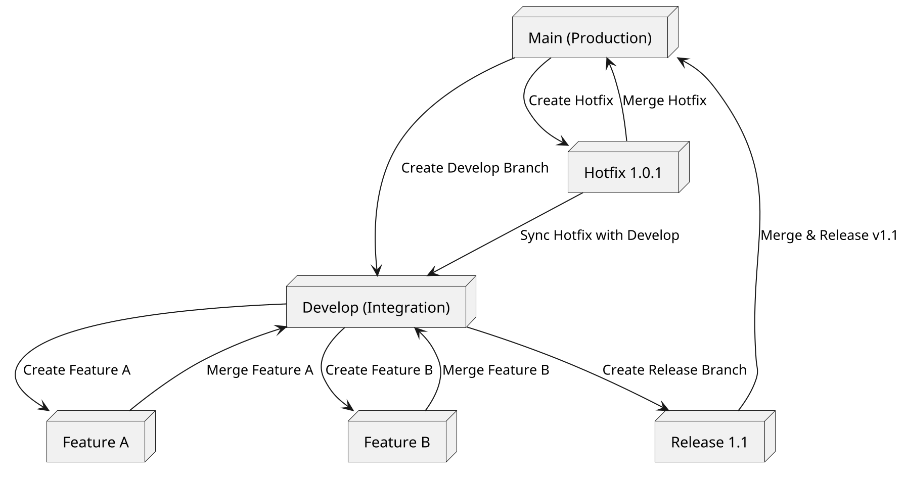
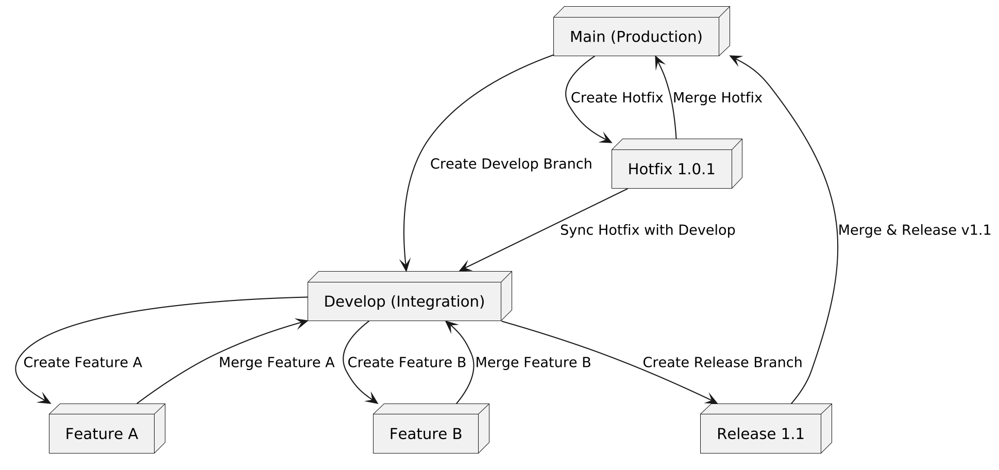
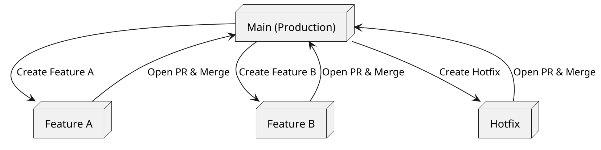
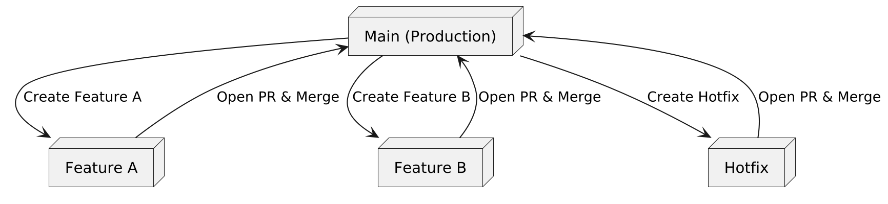

# GitFlow Branching Model



# GitHub Flow Branching Model



# Key Differences Between GitFlow and GitHub Flow
1. **GitFlow**:
   - Uses **two long-lived branches** (`main` and `develop`).
   - Has **temporary branches** for features, releases, and hotfixes.
   - Features are merged into `develop`, then stabilized in a release branch before merging into `main`.
   - Used in projects where **multiple versions** need to be maintained.

2. **GitHub Flow**:
   - Only **one long-lived branch** (`main`).
   - Features are developed in **short-lived feature branches**.
   - Changes are merged directly into `main` via Pull Requests (PRs).
   - Simpler and more suitable for **continuous deployment**.

# Scenario: GitHub Flow Struggles While GitFlow Handles It Gracefully

## **Step 1: The Problem – Interdependent Features & Urgent Hotfix**  
Imagine a banking software project where multiple teams work on the same repository:  
- **Team A** is building a major **credit card application system (Feature A)**.  
- **Team B** is working on a small **UI improvement (Feature B)**.  
- **Team C** finds a **critical security vulnerability** that requires an urgent hotfix.  

## **Step 2: Why GitHub Flow Fails**  
GitHub Flow follows a simple process where **all feature branches must be fully completed and tested before merging into main**, which is always production-ready.  

1. **Feature A (Team A) is still in progress**, but some of its refactored code is needed by Feature B.  
2. **Feature B (Team B) is ready** to be merged but depends on Feature A’s refactoring.  
   - **Problem:** Since Feature A is incomplete and cannot be merged yet, **Feature B is blocked** from merging.  
3. **Security hotfix (Team C) must be deployed immediately**, but since Team B is blocked by Team A, main is not in a stable state for release.  
   - If Team C creates a separate **hotfix branch** and merges it to main, there could be **merge conflicts** later with Feature A & B.  
   - **Cherry-picking commits** is possible but **risky**, especially for deeply interdependent code.  

 **Result: Deadlock** – Feature A blocks Feature B, and both indirectly block the urgent security fix. GitHub Flow struggles when interdependencies exist.  

---

## **Step 3: How GitFlow Handles It Gracefully**  
GitFlow has a structured branching model with separate **develop, release, and hotfix branches**, which helps resolve this problem.  

 **Feature A stays in its feature branch (feature/feature-A)**, isolated from production.  
 **Feature B merges into the develop branch**, even though Feature A is incomplete.  
 **The security hotfix is branched from main, fixed, and released immediately** without waiting for ongoing features.  
 After deployment, the **hotfix is merged back into both main and develop** to keep everything synchronized.  

 **Result: No Deadlock!**  
- Feature A continues without blocking Feature B.  
- Feature B progresses independently in the develop branch.  
- The hotfix is applied quickly without waiting for incomplete features.  

---

## **Final Takeaway**  
| **GitHub Flow (Fails)** | **GitFlow (Works Well)** |
|--------------------------|--------------------------|
| **Only one main branch** – Everything merges into main. | **Develop branch exists** – Incomplete work can be merged. |
| **Incomplete work cannot be merged** – Causes a deadlock. | **Work continues in develop** without affecting main. |
| **Cherry-picking is risky** when resolving dependencies. | **Release & hotfix branches provide stability**. |
| **Hotfix deployment is complicated** if features are waiting. | **Hotfix can be deployed separately** without issue. |

🔹 **GitHub Flow is best for small, independent features with frequent releases.**  
🔹 **GitFlow is better for larger, interdependent teams working on long-term projects.**  

This is why **GitFlow handles this situation more efficiently** than GitHub Flow! 


# Release Process in GitFlow vs. GitHub Flow

## Step-by-Step GitHub Flow Release Process (Simpler, Continuous Delivery)
GitHub Flow is designed for **fast-moving, frequent deployments** where every change is ready to go live.  

 **Create a Feature Branch**  
   - Developers create a branch from `main`:  
     ```sh
     git checkout -b feature-xyz
     ```
  
 **Develop & Commit Changes**  
   - The developer works on the feature, commits changes, and pushes to GitHub:  
     ```sh
     git push origin feature-xyz
     ```

 **Open a Pull Request (PR) & Code Review**  
   - The feature is reviewed and tested.  
   - If there are issues, changes are made directly in the branch.  

 **Rebase (if needed) & Merge into Main**  
   - If `main` has been updated, the feature branch is rebased:  
     ```sh
     git checkout feature-xyz
     git rebase main
     ```
   - Once approved, the PR is merged into `main`:  
     ```sh
     git checkout main
     git merge feature-xyz
     ```

 **Deploy Immediately**  
   - Since `main` is always deployable, the merged code is automatically deployed.  


## Step-by-Step GitFlow Release Process (Structured, Release-Oriented):

GitFlow is designed for **larger, structured releases** where development is separated from production.  

### Development Phase  
 **Developers work in feature branches** from `develop`:  
   ```sh
   git checkout -b feature-xyz develop
   ```  
 **Feature branches are merged into `develop`** when completed:  
   ```sh
   git checkout develop
   git merge feature-xyz
   ```


### Creating a Release Branch  
 **When a set of features is ready for release, a release branch is created:**  
   ```sh
   git checkout -b release-v1.0 develop
   ```  
 **Final testing, bug fixes, and minor changes** are made in the release branch.  


### Deploying & Merging Release into Main  
 **Once tested, the release branch is merged into `main` for deployment:**  
   ```sh
   git checkout main
   git merge release-v1.0
   git tag v1.0
   git push origin main --tags
   ```  

 **Merge back into `develop`** to ensure future development includes these changes:  
   ```sh
   git checkout develop
   git merge release-v1.0
   ```

 **Release branch is deleted** after the merge:  
   ```sh
   git branch -d release-v1.0
   ```


### Hotfixes for Critical Issues
 **If a critical bug is found in production, a hotfix branch is created from `main`:
   ```sh
   git checkout -b hotfix-security-fix main
   ```  
 **After fixing, it's merged into both `main` and `develop`: 
   ```sh
   git checkout main
   git merge hotfix-security-fix
   git checkout develop
   git merge hotfix-security-fix
   ```


## Key Differences Between GitHub Flow & GitFlow
| **Aspect** | **GitHub Flow** | **GitFlow** |
|------------|---------------|------------|
| **Use Case** | Fast-moving, continuous deployment | Structured, versioned releases |
| **Branching Model** | Only `main` and feature branches | `develop`, `main`, `feature`, `release`, `hotfix` |
| **Merging Strategy** | Feature branches merge directly into `main` | Features merge into `develop`, then `release`, then `main` |
| **Deployments** | Every merge to `main` is deployable | Releases are scheduled, tested, and deployed |
| **Hotfix Handling** | Directly on `main`, then rebase feature branches | Hotfix branch from `main`, merged into both `main` and `develop` |

---

## When to Use Which?
 **Use GitHub Flow when:**  
- You release frequently (CI/CD).  
- Small teams with independent features.  
- Main branch must always be deployable.  

 **Use GitFlow when:**  
- Releases are structured and versioned.  
- Multiple teams working on interdependent features.  
- You need separate stabilization/testing before deployment.  

---

## Conclusion
**GitHub Flow = Simple, Fast, Continuous Deployment**  
**GitFlow = Structured, Stable, Ideal for Large Teams**  
