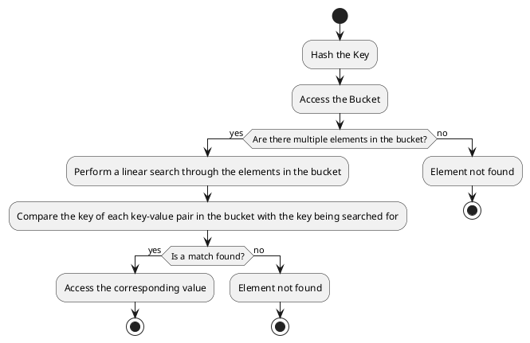

# The implementation and memory representation of `unordered_map` in the C++ Standard Template Library (STL):

1. **Storage**: An `unordered_map` is essentially a hash table, which is an array of buckets.
   Each bucket can contain zero or more key-value pairs.
   **NOTE** It stores key-value pairs and not only values. As when there is collision , the resolution requires key to compare and find the exact element.

2. **Hashing**: When an element is inserted into the `unordered_map`, its key is hashed to determine the index of the bucket where it should be stored.
   If multiple keys hash to the same index, they are all stored in the same bucket.

3. **Bucket Data Structure**: Each bucket is typically implemented as a linked list (or similar data structure) of structures (or pairs), each containing a key and its associated value.

4. **Iteration**: Iteration over an `unordered_map` proceeds through each bucket in the array, and for each bucket, through each element in the bucket.
   The order of iteration is not the order of insertion, and is not predictable.

5. **Invalidation by Insertion**: If an insertion causes the `unordered_map` to rehash its elements (which happens when the load factor exceeds a certain threshold), all iterators to elements in the `unordered_map` are invalidated.
   This is because rehashing involves allocating a new array of buckets and moving the elements from the old array to the new one, which can cause them to be located at different addresses in memory.

6. **Insertion/Deletion**: Insertion involves hashing the key, locating the appropriate bucket, and adding a new element to that bucket.
   Deletion involves hashing the key, locating the appropriate bucket, and removing the element from that bucket.
   Both operations can be done in constant time on average, but in the worst case (when all keys hash to the same index), they can take linear time.

# The determination of the initial size and the condition to resize an `unordered_map` in the C++ Standard Template Library (STL):

1. **Initial Size**: The initial size of the hashtable in an `unordered_map` is implementation-defined, which means it can vary between different compilers or versions of the STL.
   However, it's typically chosen to be a small size that offers a good balance between memory usage and performance.

2. **Condition to Resize**: The hashtable in an `unordered_map` is resized when the load factor (the number of elements divided by the number of buckets) exceeds a certain threshold.
   This threshold is also implementation-defined, but a common choice is 1.0, meaning the hashtable is resized when the number of elements equals the number of buckets.
       - **Load Factor Calculation**: The STL `unordered_map` keeps track of the number of elements and the number of buckets, so it can calculate the load factor in constant time, without needing to iterate over the elements.
         When an element is inserted, the `unordered_map` increments its count of elements and then checks if the load factor exceeds the threshold.

3. **Resizing Process**: When the `unordered_map` is resized, it allocates a new array of buckets that is typically at least twice the size of the old array.
   Then, it rehashes each element in the old array and inserts it into the new array.
   This can cause the elements to be located at different addresses in memory, which is why all iterators to elements in the `unordered_map` are invalidated when it is resized.

4. **Amortized Cost of Resizing**: While the resizing operation can be expensive when it happens, it happens infrequently enough that the cost is spread out over many insertions. As a result, the average cost of an insertion is still constant time.

# Breakdown of the search process in an `unordered_map` when collisions occur:

1. **Hash the Key**: The key of the element to be searched is hashed using the same hash function used by the `unordered_map`.
   This gives the index of the bucket where the element would be located if it is present in the `unordered_map`.

2. **Access the Bucket**: The bucket at the calculated index is accessed.
   This operation is O(1), or constant time, because accessing an element in an array by its index is a constant time operation.

3. **Search the Bucket**: If there are multiple elements in the bucket (due to collisions), a linear search is performed through the elements in the bucket.
   This is where the key-value pairs are compared.

    - **Key Comparison**: The key of each key-value pair in the bucket is compared with the key being searched for.
      If a match is found, that means the element has been found.

    - **Value Access**: If the keys match, the corresponding value can be accessed.
      Note that the value isn't used in the search operation; it's the key that determines if the correct element has been found.

    The time complexity of the search operation is O(n), where n is the number of elements in the bucket.
    This is because in the worst-case scenario (when all keys hash to the same index), a linear search through all the elements would be necessary.

## A PlantUML activity diagram representation for the search process in an unordered_map:


## A simple code snippet to illustrate the search operation:

```cpp
std::unordered_map<std::string, int> map;
map["key1"] = 1;
map["key2"] = 2;  // Assume "key2" hashes to the same index as "key1"

std::string keyToSearch = "key1";
auto it = map.find(keyToSearch);
if (it != map.end()) {
    std::cout << "Found " << it->first << ": " << it->second << "\n";
} else {
    std::cout << "Did not find " << keyToSearch << "\n";
}
```

In this code, `map.find(keyToSearch)` returns an iterator to the element with key `keyToSearch` if it is found, or `map.end()` if it is not found.
The key-value pair can be accessed through the iterator `it`.
