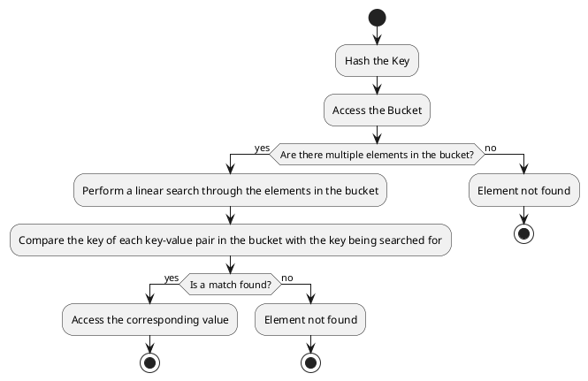

# The implementation and memory representation of `unordered_map` in the C++ Standard Template Library (STL):

1. **Storage**: An `unordered_map` is essentially a hash table, which is an array of buckets.
   Each bucket can contain zero or more key-value pairs.
   **NOTE** It stores key-value pairs and not only values. As when there is collision , the resolution requires key to compare and find the exact element.

2. **Hashing**: When an element is inserted into the `unordered_map`, its key is hashed to determine the index of the bucket where it should be stored.
   If multiple keys hash to the same index, they are all stored in the same bucket.

3. **Bucket Data Structure**: Each bucket is typically implemented as a linked list (or similar data structure) of structures (or pairs), each containing a key and its associated value.

4. **Iteration**: Iteration over an `unordered_map` proceeds through each bucket in the array, and for each bucket, through each element in the bucket.
   The order of iteration is not the order of insertion, and is not predictable.

5. **Invalidation by Insertion**: If an insertion causes the `unordered_map` to rehash its elements (which happens when the load factor exceeds a certain threshold), all iterators to elements in the `unordered_map` are invalidated.
   This is because rehashing involves allocating a new array of buckets and moving the elements from the old array to the new one, which can cause them to be located at different addresses in memory.

6. **Insertion/Deletion**: Insertion involves hashing the key, locating the appropriate bucket, and adding a new element to that bucket.
   Deletion involves hashing the key, locating the appropriate bucket, and removing the element from that bucket.
   Both operations can be done in constant time on average, but in the worst case (when all keys hash to the same index), they can take linear time.

# The determination of the initial size and the condition to resize an `unordered_map` in the C++ Standard Template Library (STL):

1. **Initial Size**: The initial size of the hashtable in an `unordered_map` is implementation-defined, which means it can vary between different compilers or versions of the STL.
   However, it's typically chosen to be a small size that offers a good balance between memory usage and performance.

2. **Condition to Resize**: The hashtable in an `unordered_map` is resized when the load factor (the number of elements divided by the number of buckets) exceeds a certain threshold.
   This threshold is also implementation-defined, but a common choice is 1.0, meaning the hashtable is resized when the number of elements equals the number of buckets.
       - **Load Factor Calculation**: The STL `unordered_map` keeps track of the number of elements and the number of buckets, so it can calculate the load factor in constant time, without needing to iterate over the elements.
         When an element is inserted, the `unordered_map` increments its count of elements and then checks if the load factor exceeds the threshold.

3. **Resizing Process**: When the `unordered_map` is resized, it allocates a new array of buckets that is typically at least twice the size of the old array.
   Then, it rehashes each element in the old array and inserts it into the new array.
   This can cause the elements to be located at different addresses in memory, which is why all iterators to elements in the `unordered_map` are invalidated when it is resized.

4. **Amortized Cost of Resizing**: While the resizing operation can be expensive when it happens, it happens infrequently enough that the cost is spread out over many insertions. As a result, the average cost of an insertion is still constant time.

# Breakdown of the search process in an `unordered_map` when collisions occur:

1. **Hash the Key**: The key of the element to be searched is hashed using the same hash function used by the `unordered_map`.
   This gives the index of the bucket where the element would be located if it is present in the `unordered_map`.

2. **Access the Bucket**: The bucket at the calculated index is accessed.
   This operation is O(1), or constant time, because accessing an element in an array by its index is a constant time operation.

3. **Search the Bucket**: If there are multiple elements in the bucket (due to collisions), a linear search is performed through the elements in the bucket.
   This is where the key-value pairs are compared.

    - **Key Comparison**: The key of each key-value pair in the bucket is compared with the key being searched for.
      If a match is found, that means the element has been found.

    - **Value Access**: If the keys match, the corresponding value can be accessed.
      Note that the value isn't used in the search operation; it's the key that determines if the correct element has been found.

    The time complexity of the search operation is O(n), where n is the number of elements in the bucket.
    This is because in the worst-case scenario (when all keys hash to the same index), a linear search through all the elements would be necessary.

## A PlantUML activity diagram representation for the search process in an unordered_map:


## A simple code snippet to illustrate the search operation:

```cpp
std::unordered_map<std::string, int> map;
map["key1"] = 1;
map["key2"] = 2;  // Assume "key2" hashes to the same index as "key1"

std::string keyToSearch = "key1";
auto it = map.find(keyToSearch);
if (it != map.end()) {
    std::cout << "Found " << it->first << ": " << it->second << "\n";
} else {
    std::cout << "Did not find " << keyToSearch << "\n";
}
```

In this code, `map.find(keyToSearch)` returns an iterator to the element with key `keyToSearch` if it is found, or `map.end()` if it is not found.
The key-value pair can be accessed through the iterator `it`.

# Iterators to elements in an unordered_map may be invalidated by insertions?
This is true. According to the C++ Standard, insertions into an unordered_map can invalidate iterators if rehashing occurs.

# What is load factor and how it is calculated ?
The **load factor** is a measure that indicates how full a hash table is.
It's calculated by taking the number of elements in the hash table and dividing it by the number of slots (or buckets) available in the table.
Load factor = (Number of elements in the hash table) / (Number of slots or buckets in the hash table)
A higher load factor means the hash table is more filled, which could lead to more collisions.
Keeping the load factor low is generally preferred to reduce the likelihood of collisions and maintain efficient performance of the hash table operations..

# Differences between `std::hash` functions and cryptographic hash functions:

1. **Calculation**:
   - `std::hash`        : Designed for speed, it quickly computes a hash value that helps in placing an object in a hash table.
   - Cryptographic hash : Computes a hash value in a way that makes it extremely difficult to reverse-engineer or find collisions. It's more complex and involves multiple rounds of processing.

2. **Complexity**:
   - `std::hash`        : Generally has lower computational complexity and is faster.
   - Cryptographic hash : Has higher computational complexity due to its design to be secure against cryptographic attacks.

3. **Insertion/Deletion Cost (Runtime Cost of Calculation)**:
   - `std::hash`        : Lower cost, as it's optimized for quick insertions and deletions in hash-based containers like `std::unordered_map` and `std::unordered_set`⁷.
   - Cryptographic hash : Higher cost, as the secure computation takes more time and resources.

4. **Search Cost (Probe/Search Efficiency)**:
   - `std::hash`        : High efficiency in searching, as it's designed to minimize collisions in a typical use-case scenario.
   - Cryptographic hash : While also efficient, the primary goal is security rather than speed, which can affect search efficiency.

5. **Different Hash Functions Provided in std**:
   - `std::hash` is part of the C++ Standard Library and provides hash functions for fundamental types and some library types.
     Provides a basic hash function for various data types like integers, strings, etc.
     Can be specialized for custom types by overloading the `operator()` function.

6. **Available Cryptographic Hash Functions in std and Other Third-Party Libraries**:
   - The C++ Standard Library (`std`) does not provide cryptographic hash functions.
     However, third-party libraries like OpenSSL, Botan, and Crypto++ offer a variety of cryptographic hash functions, including SHA-256, SHA-3, and others.

In summary, `std::hash` is suitable for general-purpose use in hash tables where the emphasis is on speed and efficiency.
Cryptographic hash functions are used when security is paramount, such as in password hashing or digital signatures, where the ability to withstand cryptographic attacks is critical.
Third-party libraries are needed to use cryptographic hash functions in C++ as they are not part of the standard library.

## Examples to implement a hash function for an `Order` class using both `std::hash` and a cryptographic hash function.
    Note that these are illustrative examples and not actual hash values.
    Also note Cryptographic hash functions are irrelevant for Order IDs as they are designed for security purposes, not for efficient key distribution within a hash table.
    Their primary goal is to create unique and unpredictable outputs even for similar inputs, which is not necessary for order IDs.

### The `Order` class:

```cpp
#include <string>

class Order {
public:
    std::string sym;
    int qty;
    int ask;
    int bid;
    // ... other members ...

    Order(std::string s, int q, int a, int b) : sym(s), qty(q), ask(a), bid(b) {}
};
```

### For `std::hash`, specialize the `std::hash` template for `Order` class:
In the `std::hash` example, we combine the hashes of each member of `Order` using XOR.

```cpp
#include <functional>

namespace std {
template<>
struct hash<Order> {
    std::size_t operator()(const Order& order) const {
        return hash<string>()(order.sym) ^ hash<int>()(order.qty) ^ hash<int>()(order.ask) ^ hash<int>()(order.bid);
    }
};
}
```

### For a cryptographic hash function, you might use a library like OpenSSL and hash the serialized representation of the order:
In the cryptographic example, we concatenate the string representations of the members and then compute the SHA-256 hash of the resulting string.

```cpp
#include <openssl/sha.h>
#include <sstream>
#include <iomanip>

std::string hashOrder(const Order& order) {
    std::ostringstream oss;
    oss << order.sym << order.qty << order.ask << order.bid;
    std::string orderStr = oss.str();

    unsigned char hash[SHA256_DIGEST_LENGTH];
    SHA256_CTX sha256;
    SHA256_Init(&sha256);
    SHA256_Update(&sha256, orderStr.c_str(), orderStr.size());
    SHA256_Final(hash, &sha256);

    std::stringstream ss;
    for(int i = 0; i < SHA256_DIGEST_LENGTH; i++) {
        ss << std::hex << std::setw(2) << std::setfill('0') << (int)hash[i];
    }
    return ss.str();
}
```
# What is identity hash?
In the context of hashing, an identity hash refers to a method where the hash value of an object is simply the object's memory address.
This means the hash function essentially returns the pointer value of the object itself.

**Beakdown of identity hash:***

**Concept:**
* Instead of performing any calculations to generate a unique hash value, the object's memory address is used directly.
* This approach assumes that objects residing at different memory locations are guaranteed to be distinct.

**Use Cases:**
* Identity hash is rarely used in general-purpose hashing scenarios due to its limitations.
* It might be used in specific situations where object identity is more important than content-based comparisons.
* For example, it could be used in certain internal data structures where quick object lookup based on memory address is necessary.

**Limitations:**
* **Non-Uniqueness:**
    If two objects have the same content but reside at different memory locations, they will have different identity hashes.
    This can lead to collisions and incorrect lookups.
* **Memory-Dependence:**
    The hash value depends on the object's memory address, which can change if the object is moved in memory due to reallocation or garbage collection.
    This makes identity hash unreliable for persistent storage or distributed systems.

**Alternatives:**
* In most cases, it's preferable to use standard hashing functions that calculate a hash value based on the object's actual content.
  This ensures uniqueness even if objects have the same memory address.

**Summary:**
Identity hash is a simple but limited hashing approach. While it might be suitable for niche cases where object identity is paramount, it's generally not recommended for general-purpose hashing due to its lack of uniqueness and memory dependence.

# What is means by "properly aligned doubles"?

**Memory Layout:**

* Computer memory is organized into bytes, the smallest unit of addressable storage.
* Doubles, however, typically occupy 8 bytes (64 bits) of memory.

**Alignment:**
* **Alignment** refers to how the starting address of a data element coincides with the boundaries of its natural data type.
  * In the case of doubles, proper alignment means the starting address is a multiple of 8 (i.e., divisible by 8).
    This ensures the entire double resides within contiguous memory locations.

**Example (C++):**

```c++
double value1 = 3.14;
double value2;

// Print memory addresses
std::cout << "Address of value1: " << &value1 << std::endl;
std::cout << "Address of value2: " << &value2 << std::endl;
```

**Explanation:**
* If the system allocates memory efficiently, the addresses of `value1` and `value2` will differ by exactly 8 bytes.
  This indicates proper alignment.

**Impact on Performance:**
* Modern processors are optimized to work with aligned data.
* Misaligned data access can require additional processing steps, leading to performance penalties.
* This is because the processor might need to fetch data from multiple memory locations to assemble the complete double.

**Real-World Example:**
* Consider a program that processes large arrays of doubles.
* If the doubles are not properly aligned, the performance can be significantly slower compared to when they are aligned.
  This can be especially noticeable in computationally intensive tasks involving numerical calculations.

**Additional Notes:**
* Most modern compilers and programming languages automatically ensure proper alignment for basic data types like doubles.
* However, it's essential to be aware of alignment issues when dealing with manual memory management or working with interoperability between different programming languages or platforms.

**In essence, "properly aligned doubles" signifies efficient memory usage and optimized performance for operations involving doubles.**
# what is "prime-number bucket counts" ?
Prime numbers are sometimes used for bucket counts in hash tables.


**Collision Resolution:**
* Hash tables rely on a technique called collision resolution to handle situations where multiple keys hash to the same bucket.
* A good hash function aims to distribute keys uniformly across buckets, but collisions can still occur.

**Prime Numbers and Collision Reduction:**
* It's true that using prime numbers for bucket counts can help reduce collisions.
  This is because prime numbers have fewer factors (divisors) other than 1 and itself.
* When the number of buckets is a prime number, it's less likely that the hash function's output will be divisible by the number of buckets, leading to fewer collisions.

**Why Not Always Use Prime Numbers?**
* While prime numbers offer some benefits, they're not always the best choice.
* In some cases, using a power of 2 (e.g., 2^n) for the bucket count might be more efficient due to hardware optimizations for memory access patterns.
* The C++ standard doesn't mandate the use of prime numbers, leaving the implementation details to the compiler or library vendor.

**Real-World Scenario:**
* In practice, `std::unordered_map` and `std::unordered_set` implementations often use a dynamic resizing strategy.
* The initial bucket count might not be a prime number, but it can be resized to a prime number or another suitable value as the number of elements grows.

**Summary:**
* Prime numbers can be beneficial for reducing collisions in hash tables.
* However, `std::unordered_containers` are not strictly limited to using prime numbers for bucket counts.
  The implementation might choose different strategies based on performance considerations.

# Prime numbers for bucket counts in hash table minimize the number of collissions:
  The idea behind using prime numbers for bucket counts in a hash table is to minimize the number of collisions.
  A collision occurs when two different keys produce the same hash value and thus are assigned to the same bucket.

  Here's an example to illustrate the concept:

  Imagine you have a hash table with 10 buckets (which is not a prime number) and a simple hash function: `hash(key) = key % 10`.
  If you insert keys that are multiples of 10, they will all hash to bucket 0, causing many collisions.

  Now, let's change the number of buckets to 11, which is a prime number, and use the same hash function: `hash(key) = key % 11`.
  The keys that are multiples of 10 will now be distributed across different buckets (1, 2, 3, ..., 10), significantly reducing the likelihood of collisions.

  The reason prime numbers work better is that they are not divisible by other numbers (except for 1 and themselves)
  , so when you use a prime number as the modulus, the keys are less likely to be grouped into the same bucket unless they are specifically multiples of the bucket count.
  This results in a more even distribution of keys across the buckets, which is desirable for efficient hash table performance.
